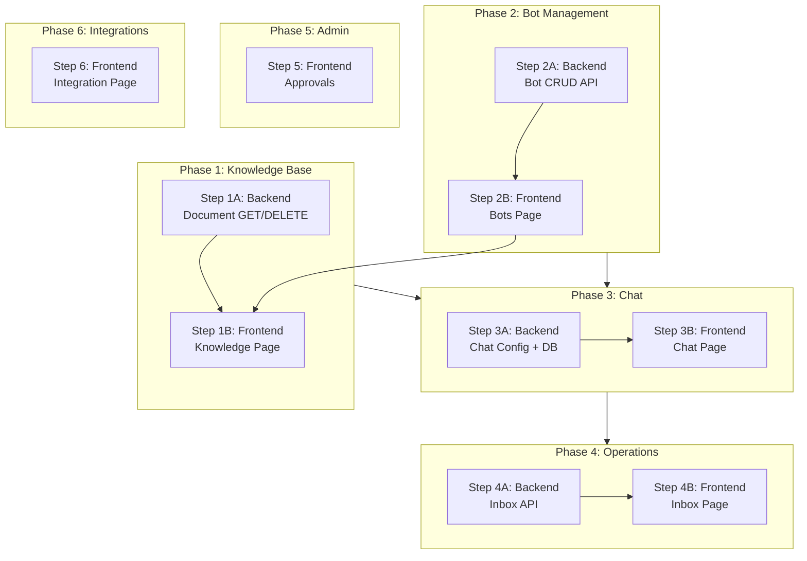

# SUNDAE — Next Steps Implementation Prompts (V2)

> **วันที่อัพเดท**: 28 กุมภาพันธ์ 2569
> **อ้างอิง**: walkthrough Current status and next step.md → Section 9  
> **รูปแบบ**: แยก Backend / Frontend เป็นคนละ Step  
> **UI Reference**: Figma designs อยู่ในโฟลเดอร์ `Figma-Sundae/`  
> **แนวคิด**: Full Stack DevOps + AI Expert

---

## ภาพรวม Figma Design System

**สังเกตจาก Figma ทั้งหมด:**
- **Branding**: ชื่อ "BINGSU" + mascot icon (ตัวบิงซู)
- **Sidebar**: Home → Bots → Knowledge → Integration → Profile (ล่างสุด)
- **สี**: Primary Yellow `#FFD100`, Background Light Gray `#F5F5F5`, Card White `#FFFFFF`
- **Card style**: Rounded corners (16px), dashed border, minimal shadows
- **Buttons**: Yellow rounded pill (`Create bot +`, `Add knowledge collection +`)
- **Layout**: Sidebar fixed left + Content area right
- **Auth pages**: Yellow border frame, NT logo top-left, centered card

**⚠️ สิ่งที่ Figma มีแต่โค้ดปัจจุบันยังไม่มี:**
- **Integration Page** (LINE + Website toggle cards) — ไม่มีใน walkthrough เลย
- **Bot Selector dropdown** บน HomePage (Select Bots ▾)
- **Verify Email Page** — ไม่มีใน walkthrough
- **Knowledge detail page** (เข้าไปดูเอกสารใน collection + drag-drop upload)

---

## Step Map (10 Steps)

| Step | ประเภท | งาน | Figma Ref | สถานะ |
|------|--------|------|-----------|-------|
| **1A** | 🔧 Backend | Document API — เพิ่ม GET/DELETE endpoints | — | ✅ Done |
| **1B** | 🎨 Frontend | Knowledge Page — เชื่อม API + ตาม Figma | `Knowledge Page.png`, `Knowledge Page2.png` | ✅ Done (status badge ⬜) |
| **2A** | 🔧 Backend | Bot CRUD API — สร้าง router ใหม่ | — | ✅ Done |
| **2B** | 🎨 Frontend | Bots Page + Create Bot — ตาม Figma | `Bots Page.png`, `Create Bots Page.png` | ✅ Done |
| **3A** | 🔧 Backend | Chat API — ปรับ config + DB setup | — | ✅ Done |
| **3B** | 🎨 Frontend | Chat Page — ปรับ bot selector ตาม Figma | `HomePage1.png` | 🟡 Partial (รอ qwen2.5:3b) |
| **4A** | 🔧 Backend | Inbox API — สร้าง router ใหม่ | — | ✅ Done |
| **4B** | 🎨 Frontend | Inbox Page — สร้าง UI จริง | (ไม่มี Figma — ใช้ design system เดิม) | ⬜ ยังไม่ทดสอบ frontend |
| **5** | 🎨 Frontend | Approvals — เชื่อม Supabase จริง | `Approval.png` | ✅ Done (re-test 11.5 ⬜) |
| **6** | 🎨 Frontend | Integration Page — สร้างใหม่ตาม Figma | `Intregration.png` | ✅ Done (toggle local state) |

---

## Step 1A: 🔧 Backend — Document API (เพิ่ม GET/DELETE)

### Prompt สำหรับ AI:

```
คุณเป็น Full Stack Developer ที่เชี่ยวชาญ FastAPI + Supabase

## บริบท (Context)
โปรเจกต์ SUNDAE เป็น Enterprise AI Chatbot Platform | Stack: FastAPI + React + Supabase + Ollama
ไฟล์ `backend/app/routers/document.py` มี endpoint เดียวคือ `POST /api/documents/upload` ที่ทำงานครบ
(รับ PDF → extract text → chunk → embed → store)

Frontend มี API wrapper ใน `src/api/endpoints.ts` พร้อมแล้ว:
- `documentsApi.list(organizationId)` → GET /api/documents
- `documentsApi.getStatus(documentId)` → GET /api/documents/{id}
- `documentsApi.delete(documentId)` → DELETE /api/documents/{id}
แต่ Backend ยังไม่มี endpoint เหล่านี้

## งานที่ต้องทำ
เพิ่ม 3 endpoints ใน `backend/app/routers/document.py` (ไม่ต้องสร้างไฟล์ใหม่):

### 1. GET /api/documents — list documents by organization
- Query parameter: `organization_id` (required)
- Query จาก `documents` table
- Filter by `organization_id` (multi-tenant isolation — สำคัญมาก)
- Order by `created_at DESC`
- Return: list of document objects

### 2. GET /api/documents/{document_id} — get single document
- Path parameter: `document_id`
- Query parameter: `organization_id` (required)
- ต้อง validate ว่า document เป็นของ org นั้นจริง
- Return: single document object

### 3. DELETE /api/documents/{document_id} — delete document + all chunks
- Path parameter: `document_id`
- Query parameter: `organization_id` (required)
- ไม่ต้องลบ chunks แยก — DB มี ON DELETE CASCADE อยู่แล้ว
  (documents → document_parent_chunks → document_child_chunks)
- ลบ document row เดียวพอ
- Return: { "message": "Document deleted", "document_id": "..." }

## กฎ
- ทุก endpoint ต้องใช้ `user: CurrentUser = Depends(require_approved)` สำหรับ auth
- ทุก query ต้อง filter by `organization_id` เสมอ (backend ใช้ Service Role Key ที่ bypass RLS)
- ใช้ `get_supabase()` สำหรับ database operations
- Imports ที่ต้องการมี import อยู่ในไฟล์แล้ว
- อย่าแก้ endpoint `POST /upload` ที่มีอยู่
- สร้าง Pydantic response model ที่เหมาะสม

## Database Schema ที่เกี่ยวข้อง
documents: id(UUID PK), organization_id(UUID FK), bot_id(UUID FK nullable),
           name(TEXT), file_path(TEXT), file_size_bytes(BIGINT),
           mime_type(TEXT), status(TEXT: pending/processing/ready/error), created_at
```

### ✅ เกณฑ์สำเร็จ
- [x] `GET /api/documents?organization_id=xxx` returns document list
- [x] `GET /api/documents/{id}?organization_id=xxx` returns single document
- [x] `DELETE /api/documents/{id}?organization_id=xxx` ลบสำเร็จ + cascading chunks
- [x] ทุก endpoint มี auth + org isolation
- [x] ทดสอบผ่าน Swagger UI (`/docs`) ได้

---

## Step 1B: 🎨 Frontend — Knowledge Page (ตาม Figma)

### Figma Reference:
- **Knowledge Page.png** → หน้า list แสดง knowledge cards + ปุ่ม "Add knowledge collection +"
- **Knowledge Page2.png** → หน้า detail ของ collection แต่ละตัว + drag-drop upload area

### Prompt สำหรับ AI:

```
คุณเป็น Frontend Developer ที่เชี่ยวชาญ React + TypeScript + Tailwind v4

## บริบท (Context)
โปรเจกต์ SUNDAE | ไฟล์ `src/pages/KnowledgeBasePage.tsx` ปัจจุบันเป็น stub
(มีแค่ table เปล่า + ปุ่ม "อัปโหลดเอกสาร" ที่ไม่ทำอะไร)

Backend API endpoints พร้อมแล้ว (หลังทำ Step 1A):
- POST /api/documents/upload (multipart form: file, organization_id, bot_id)
- GET /api/documents?organization_id=xxx
- DELETE /api/documents/{id}?organization_id=xxx

Frontend มีพร้อมแล้ว:
- `src/api/endpoints.ts` → `documentsApi` (upload, list, getStatus, delete)
- `src/types/index.ts` → `Document`, `DocumentStatus`, `DocumentUploadResponse`
- `src/store/authStore.ts` → `useAuthStore` (มี user.organization_id)

## Figma Design ที่ต้องทำตาม (ดูจากรูปในโฟลเดอร์ Figma-Sundae/)

### หน้า Knowledge (list view) — `Knowledge Page.png`:
- Header: "Knowledge" + search bar "Search Models" + ปุ่ม "Add knowledge collection +" (สีเหลือง pill)
- Content: Card แสดงแต่ละ document/collection
  - Card style: rounded corners, dashed border
  - แสดง: ชื่อ, คำอธิบาย (prompt), "By Name Surname", "Update ล่าสุด 4 นาทีก่อน"
- Click card → เข้าหน้า detail

### หน้า Knowledge detail — `Knowledge Page2.png`:
- Header: ชื่อ collection + คำอธิบาย + ปุ่ม "+" (มุมขวาบน)
- Content area: Drag and drop zone
  - ข้อความ "Drag and drop a file to upload or select a file to view"
  - Rounded corners, dashed border
- แสดง list ไฟล์ที่ upload แล้ว (ถ้ามี)

## งานที่ต้องทำ
เขียน `KnowledgeBasePage.tsx` ใหม่ให้ตรง Figma:

### 1. State Management
- useState: documents list, loading, error, selectedDoc, uploadModalOpen
- useEffect: เรียก `documentsApi.list(orgId)` เมื่อ mount
- ดึง orgId จาก `useAuthStore` → `state.user?.organization_id`

### 2. List View (default)
- แสดง document cards ตาม Figma design
- ปุ่ม "Add knowledge collection +" → เปิด upload modal หรือ file picker
- Search bar สำหรับ filter documents by name
- แสดง status badge บนแต่ละ card:
  - pending → สีเทา
  - processing → สีเหลือง + spinner
  - ready → สีเขียว
  - error → สีแดง

### 3. Upload Flow
- Click "Add knowledge collection +" → เปิด file input (accept=".pdf")
- เรียก `documentsApi.upload(file, botId, orgId)`
- แสดง upload progress indicator
- Refresh list เมื่อ upload สำเร็จ

### 4. Detail View (click card)
- แสดง document info + drag-drop upload area ตาม Figma
- ปุ่มลบ document → confirm dialog → `documentsApi.delete(id)`

## Design System ที่ใช้
- ใช้ Tailwind classes ที่มีอยู่: brand-400 (yellow), steel-xxx (gray shades)
- Card: bg-white rounded-2xl border border-dashed border-steel-200
- Button: bg-brand-400 text-steel-900 rounded-full px-4 py-2 font-bold
- Font: Inter + Noto Sans Thai

## กฎ
- อย่าแก้ไฟล์อื่นที่ไม่ใช่ KnowledgeBasePage.tsx
- ตรงกับ Figma ให้มากที่สุดในแง่ layout + style
- รองรับ responsive (มือถือ/แท็บเล็ต)
- แสดง empty state เมื่อยังไม่มี document
```

### ✅ เกณฑ์สำเร็จ
- [x] หน้า Knowledge แสดง list documents จาก API จริง
- [x] UI ตรงกับ Figma (cards, search, yellow button)
- [x] Upload PDF ได้ + แสดงใน list ทันที
- [x] ลบ document ได้
- [ ] แสดง status badge ถูกต้อง — ⬜ (7.7 processing spinner, 7.8 ready badge ยังไม่ทดสอบครบ)
- [x] Empty state สวยงาม

---

## Step 2A: 🔧 Backend — Bot CRUD API (สร้างใหม่)

### Prompt สำหรับ AI:

```
คุณเป็น Full Stack Developer + AI Expert ที่เชี่ยวชาญ FastAPI + Supabase

## บริบท (Context)
โปรเจกต์ SUNDAE — Enterprise AI Chatbot Platform
ปัจจุบัน backend มี 3 routers: health, document, chat
ต้องสร้าง Bot management router ใหม่เพื่อให้ user สร้าง/จัดการ chatbot ได้

Bot เป็นหัวใจของ SUNDAE — กำหนดว่า AI จะตอบแบบไหน (system_prompt),
ใช้ knowledge ไหน (documents link ผ่าน bot_id), เปิด web chat หรือไม่

## Database Schema ปัจจุบัน
bots: id(UUID PK), organization_id(UUID FK), name(TEXT), description(TEXT),
      system_prompt(TEXT), is_active(BOOLEAN default true),
      created_at(TIMESTAMPTZ), updated_at(TIMESTAMPTZ)

⚠️ schema ปัจจุบันยังขาด columns ที่ frontend types ต้องการ:
- line_access_token (TEXT) — สำหรับเก็บ LINE Channel Access Token
- is_web_enabled (BOOLEAN default true) — เปิด/ปิด Web Chat

## งานที่ต้องทำ

### 1. SQL Migration (run ใน Supabase SQL Editor ก่อน)
```sql
ALTER TABLE bots ADD COLUMN IF NOT EXISTS line_access_token TEXT;
ALTER TABLE bots ADD COLUMN IF NOT EXISTS is_web_enabled BOOLEAN NOT NULL DEFAULT true;
```

### 2. สร้างไฟล์ใหม่: `backend/app/routers/bot.py`

Endpoints:
- POST   /api/bots                   → สร้าง bot ใหม่
- GET    /api/bots?organization_id   → list bots by org
- GET    /api/bots/{bot_id}          → get single bot
- PUT    /api/bots/{bot_id}          → update bot
- DELETE /api/bots/{bot_id}          → delete bot

Pydantic Models:
- BotCreateRequest: name(str required), description(str optional),
  system_prompt(str optional), organization_id(str required),
  is_web_enabled(bool default true)
- BotUpdateRequest: name, description, system_prompt, line_access_token,
  is_active, is_web_enabled (ทุกตัว optional)
- BotResponse: ทุก fields จาก DB

### 3. Register router ใน `backend/app/main.py`
เพิ่ม:
```python
from app.routers import bot
app.include_router(bot.router)
```

## กฎ
- ทุก endpoint ต้องใช้ auth: `Depends(require_approved)`
- ทุก query ต้อง filter `organization_id` (multi-tenant)
- PUT ต้อง set `updated_at = now()`
- DELETE bot → documents ที่ link กับ bot จะ SET NULL (ON DELETE SET NULL ใน schema)
- อ้างอิง pattern จาก `document.py` สำหรับ code style

## AI Expert Note
Bot's system_prompt เป็น RAG prompt ที่สำคัญ — กำหนดพฤติกรรมของ AI:
- ภาษาที่ตอบ (Thai/English)
- Tone of voice
- กฎการอ้างอิงเอกสาร
- การจัดการคำถามที่ไม่เกี่ยว
ควร provide default system_prompt ที่ดีถ้า user ไม่ได้ระบุ
```

### ✅ เกณฑ์สำเร็จ
- [x] CRUD endpoints ทำงานครบ (สร้าง/อ่าน/แก้/ลบ)
- [x] Migration columns ใหม่สำเร็จ
- [x] Router registered ใน main.py
- [x] Auth + org isolation ทุก endpoint
- [x] Swagger UI test ผ่าน

---

## Step 2B: 🎨 Frontend — Bots Page + Create Bot (ตาม Figma)

### Figma Reference:
- **Bots Page.png** → List view: Bot cards + "Create bot +" button + Search
- **Create Bots Page.png** → Create/Edit form: ชื่อบอท, รหัสโมเดล, โมเดลพื้นฐาน (Select Bots dropdown), คำอธิบาย, พารามิเตอร์ (ระบบพรอมต์), เลือกความรู้, เลือกกลุ่ม

### Prompt สำหรับ AI:

```
คุณเป็น Frontend Developer ที่เชี่ยวชาญ React + TypeScript + Tailwind v4

## บริบท (Context)
โปรเจกต์ SUNDAE | `src/pages/BotsPage.tsx` ปัจจุบันเป็น stub (grid เปล่า + ปุ่ม)

Backend API พร้อมแล้ว (หลังทำ Step 2A):
- POST /api/bots
- GET /api/bots?organization_id=xxx
- PUT /api/bots/{id}
- DELETE /api/bots/{id}

Frontend types พร้อมแล้ว:
- `src/types/index.ts` → Bot interface (id, organization_id, name, prompt,
  line_access_token, is_active, is_web_enabled, created_at, updated_at)

## Figma Design ที่ต้องทำตาม

### หน้า Bots (list) — `Bots Page.png`:
- Header: "Bots" + Search "Search Models" + ปุ่ม "Create bot +" (สีเหลือง pill)
- Bot cards: rounded corners, dashed border
  - แสดง: "Bot 1" (ชื่อ), คำอธิบาย (ตอบเป็นภาษาไทยเท่านั้น และอ้างอิงข้อมูลจากเอกสาร...)
- Empty state: เมื่อยังไม่มี bot

### หน้า Create Bot — `Create Bots Page.png`:
- ← Back button
- Avatar/icon ที่เปลี่ยนได้ + "ชื่อบอท" (input) + "รหัสโมเดล" (auto-gen)
- ปุ่ม "เพิ่มโปรไฟล์บอท" (สีเหลือง)
- "โมเดลพื้นฐาน (จาก)" — Select Bots dropdown
- "คำอธิบาย" — textarea (เพิ่มคำอธิบายสั้น ๆ สำหรับโมเดลที่ทำ)
- "พารามิเตอร์ของบอท / ระบบพรอมต์" — textarea (system prompt)
- "ความรู้" — ปุ่ม "เลือกความรู้" (link to Knowledge) (สีเหลือง)
- "ความรู้" — ปุ่ม "เลือกกลุ่ม" (สีเหลือง)

## งานที่ต้องทำ

### 1. เพิ่ม botsApi ใน `src/api/endpoints.ts`:
```typescript
export const botsApi = {
    create: (data: {...}) => apiClient.post<Bot>("/api/bots", data),
    list: (orgId: string) => apiClient.get<Bot[]>("/api/bots", { params: { organization_id: orgId } }),
    get: (botId: string) => apiClient.get<Bot>(`/api/bots/${botId}`),
    update: (botId: string, data: Partial<Bot>) => apiClient.put<Bot>(`/api/bots/${botId}`, data),
    delete: (botId: string) => apiClient.delete(`/api/bots/${botId}`),
};
```

### 2. เขียน `BotsPage.tsx` ใหม่:
- List view (default): Bot cards ตาม Figma, search, yellow create button
- Click "Create bot +" → navigate to create view
- Click card → navigate to edit view (reuse create form)

### 3. สร้าง Create/Edit Bot component (อาจเป็นหน้าใหม่หรือ modal):
- Form ตาม Figma: ชื่อบอท, คำอธิบาย, ระบบพรอมต์
- "เลือกความรู้" → แสดง list documents ให้ link กับ bot
- Save → botsApi.create() หรือ botsApi.update()
- ← Back → กลับหน้า list

## กฎ
- ตรงกับ Figma ให้มากที่สุด
- ใช้ design system เดียวกัน (brand-400, steel-xxx, rounded-2xl)
- System prompt field ต้องพอใหญ่ (textarea rows=6+)
- แสดง is_active / is_web_enabled เป็น toggle switch
```

### ✅ เกณฑ์สำเร็จ
- [x] แสดงรายการ Bots ตาม Figma design
- [x] สร้าง Bot ใหม่ได้ (form ตาม Figma)
- [x] แก้ไข Bot ได้ (system prompt, name, description)
- [x] ลบ Bot ได้
- [x] Search/filter bots ได้
- [ ] Link กับ Knowledge ได้ — ⬜ (ยังไม่ได้ทดสอบ)

---

## Step 3A: 🔧 Backend — Chat API Config + DB Setup

### Prompt สำหรับ AI:

```
คุณเป็น AI Expert + Backend Developer

## บริบท (Context)
โปรเจกต์ SUNDAE | `POST /api/chat/ask` ทำงานครบแล้ว (full RAG pipeline)
แต่ยังมีปัญหา:

1. Chat endpoint ใช้ organization_id + bot_id จาก request body
   แต่ frontend hardcode ค่า DEFAULT_BOT_ID / DEFAULT_ORG_ID
2. DB schema `chat_sessions` ยังขาด columns ที่จำเป็น

## งานที่ต้องทำ

### 1. SQL Migration — เพิ่ม columns ที่ขาดใน chat_sessions
```sql
ALTER TABLE chat_sessions ADD COLUMN IF NOT EXISTS status TEXT NOT NULL DEFAULT 'active'
    CHECK (status IN ('active', 'human_takeover', 'resolved'));
ALTER TABLE chat_sessions ADD COLUMN IF NOT EXISTS platform_source TEXT DEFAULT 'web';
ALTER TABLE chat_sessions ADD COLUMN IF NOT EXISTS platform_user_id TEXT;
```

### 2. ตรวจสอบ chat.py — อาจต้องปรับ upsert fields ให้ตรง schema ใหม่

ปัจจุบัน chat.py line 237-248 ทำ upsert chat_sessions:
```python
session_row = {
    "id": session_id,
    "organization_id": organization_id,
    "bot_id": bot_id,
    "platform_user_id": platform_user_id,
    "platform_source": platform_source,
    "last_message_at": "now()",
}
```
ตรวจสอบว่า field names ตรงกับ DB columns ใหม่

### 3. Seed data — สร้าง organization + bot สำหรับทดสอบ (ถ้ายังไม่มี)
```sql
-- สร้าง org
INSERT INTO organizations (id, name, slug)
VALUES ('ORG_UUID_HERE', 'SUNDAE Demo Org', 'sundae-demo')
ON CONFLICT DO NOTHING;

-- สร้าง bot
INSERT INTO bots (organization_id, name, system_prompt, is_active, is_web_enabled)
VALUES ('ORG_UUID_HERE', 'SUNDAE Bot', 'คุณคือ SUNDAE AI ช่วยตอบคำถามจากเอกสาร', true, true);
```

### 4. อัปเดต frontend/.env
```env
VITE_DEFAULT_BOT_ID=<UUID ที่สร้างข้างบน>
VITE_DEFAULT_ORG_ID=<UUID ที่สร้างข้างบน>
```

## AI Expert Note
RAG Pipeline ปัจจุบัน: Embed(bge-m3) → VectorSearch(pgvector) → Rerank(bge-reranker-v2-m3) → LLM(Ollama/qwen3)
ทั้งหมดทำงาน on-premise ไม่ส่งข้อมูลออกนอก — เหมาะกับ government use case
```

### ✅ เกณฑ์สำเร็จ
- [x] chat_sessions มี columns: status, platform_source, platform_user_id
- [x] มี organization + bot record ใน DB
- [x] .env มีค่าถูกต้อง
- [x] POST /api/chat/ask ทดสอบผ่าน Swagger ได้ (4.1, 4.3, 4.4 ✅)

---

## Step 3B: 🎨 Frontend — Chat Page ปรับตาม Figma

### Figma Reference:
- **HomePage1.png** → Chat page: "Select Bots" dropdown (top-left), mascot center, input area (yellow border) + attachment/mic/headphone icons, "Suggested" cards

### Prompt สำหรับ AI:

```
คุณเป็น Frontend Developer ที่เชี่ยวชาญ React + TypeScript

## บริบท (Context)
`src/pages/WebChatPage.tsx` ทำงานได้แล้ว (เชื่อม chatApi.ask())
แต่ต้องปรับให้ตรง Figma + ใช้ dynamic data แทน hardcoded

## Figma Design — `HomePage1.png`:
- **Top bar**: "Select Bots" dropdown (ซ้าย) + edit icon (ขวา)
- **Center**: BINGSU mascot + "Welcome to BINGSU LLM" + คำอธิบาย
- **Input area**: Yellow border frame, "How can I help today?..."
  - Icons: + (attach), 🖼 (image), 🎤 (mic), 🎧 (headphone) 
- **Suggested**: 3 cards ด้านล่าง input

## งานที่ต้องทำ

### 1. ปรับ WebChatPage.tsx:
- เพิ่ม Bot selector dropdown (top): ดึง bots จาก botsApi.list()
- เปลี่ยนจาก hardcoded DEFAULT_BOT_ID → ใช้ selected bot จาก dropdown
- ดึง organizationId จาก useAuthStore (state.user?.organization_id)
- ใช้ user.id เป็น platformUserId แทน random UUID

### 2. ปรับ Welcome Screen:
- ตรง Figma: mascot + welcome text + input area with yellow border
- Suggested cards ตาม design

### 3. Input area:
- Yellow border frame ตาม Figma
- (Optional) เพิ่ม icon buttons: attach, image, mic, headphone (UI only ก่อน)

## กฎ
- แก้เฉพาะ WebChatPage.tsx
- เก็บ chat logic เดิมไว้ (chatApi.ask ทำงานดีอยู่แล้ว)
- ปรับ UI ให้ตรง Figma
```

### ✅ เกณฑ์สำเร็จ
- [x] Bot selector dropdown ทำงาน (ดึง bots จาก API) — 9.1, 9.2, 9.3 ✅
- [x] ใช้ org_id + user_id จาก auth store
- [x] Welcome screen ตรง Figma
- [ ] Chat ทำงาน end-to-end (ถาม-ตอบได้) — ⬜ 9.4, 9.5 รอ `ollama pull qwen2.5:3b`

---

## Step 4A: 🔧 Backend — Inbox API (สร้างใหม่)

### Prompt สำหรับ AI:

```
คุณเป็น Full Stack Developer

## บริบท (Context)
โปรเจกต์ SUNDAE | ต้องสร้าง Inbox router ใหม่สำหรับ
Support/Admin จัดการ chat sessions (ดูประวัติแชท, human takeover)

Frontend types พร้อมแล้ว:
- ChatSession: id, organization_id, bot_id, platform_user_id, platform_source, status, started_at, last_message_at
- ChatMessage: id, session_id, organization_id, role, content, metadata, created_at

## งานที่ต้องทำ

### สร้างไฟล์ใหม่: `backend/app/routers/inbox.py`

Endpoints:
1. GET /api/inbox/sessions?organization_id=xxx
   - List chat sessions, ordered by last_message_at DESC
   - ใช้ `require_role("support", "admin")` — เฉพาะ support/admin เห็นได้
   - JOIN bot name (optional)
   - Return list of ChatSession

2. GET /api/inbox/sessions/{session_id}/messages
   - List messages ใน session
   - Ordered by created_at ASC
   - ใช้ `require_approved` — approved users เห็นได้
   - Return list of ChatMessage

3. PUT /api/inbox/sessions/{session_id}/status
   - Request body: { "status": "active" | "human_takeover" | "resolved" }
   - ใช้ `require_role("support", "admin")`
   - Update chat_sessions.status

### Register ใน main.py:
```python
from app.routers import inbox
app.include_router(inbox.router)
```

## กฎ
- multi-tenant isolation ทุก query
- Support/Admin only สำหรับ session management
- อ้างอิง pattern จาก routers อื่น
```

### ✅ เกณฑ์สำเร็จ
- [x] List sessions ได้ (filter by org) — 5.1 ✅
- [x] Get messages by session ได้ — 5.3 ✅
- [x] Update session status ได้ — 5.4, 5.5, 5.6 ✅
- [x] Auth + role check ทำงาน — 5.2 ✅ (403 สำหรับ user role)

---

## Step 4B: 🎨 Frontend — Inbox Page UI

### Prompt สำหรับ AI:

```
คุณเป็น Frontend Developer

## บริบท (Context)
`src/pages/InboxPage.tsx` เป็น stub มี 2-panel layout (sidebar + content)
แต่ยังแสดง "ยังไม่มีแชท" เท่านั้น

Backend API พร้อมแล้ว (หลังทำ Step 4A)

## งานที่ต้องทำ

### 1. เพิ่ม inboxApi ใน `src/api/endpoints.ts`

### 2. เขียน InboxPage.tsx ใหม่:

**Left Panel (Session List):**
- Search bar
- Session cards: platform icon (💬/📱), user info, last message excerpt,
  timestamp, status badge (active/human_takeover/resolved)
- Click → select session → load messages

**Right Panel (Chat View):**
- Header: user info + platform + status badge
- Messages: user/assistant bubbles (style เหมือน WebChatPage)
- Source metadata จาก assistant messages
- Action bar:
  - "รับเรื่อง" (→ human_takeover)
  - "คืนร่างให้ AI" (→ active)
  - "ปิดเคส" (→ resolved)

## Design System
- ใช้ style เดียวกับ WebChatPage (bubbles, colors)
- Status badges: active=green, human_takeover=yellow, resolved=gray
- ตรงกับ sidebar layout ของ Figma (ไม่มี Figma เฉพาะ Inbox — ใช้ design system เดิม)
```

### ✅ เกณฑ์สำเร็จ
- [ ] แสดง session list จริง — ⬜ 10.1 ยังไม่ทดสอบ frontend
- [ ] Click session → แสดง messages — ⬜ 10.4
- [ ] Toggle status ได้ (active ↔ human_takeover ↔ resolved) — ⬜ 10.7, 10.8, 10.9
- [ ] แสดง platform icon (web/line) — ⬜ 10.5
- [ ] Real-time feel (ตอนเปลี่ยน status refresh ทันที) — ⬜ 10.10

---

## Step 5: 🎨 Frontend — Approvals (เชื่อม Supabase จริง)

### Figma Reference:
- **Approval.png** → "Approval in Progress" page (สำหรับ user ที่รอ approve) — ไม่ใช่ admin view
  → แต่ AdminViewของ ApprovalsPage ที่มีอยู่แล้วดีอยู่ แค่เปลี่ยน data source

### Prompt สำหรับ AI:

```
คุณเป็น Frontend Developer

## บริบท (Context)
`src/pages/ApprovalsPage.tsx` มี UI สวยแล้ว แต่ใช้ dummy data:
- INITIAL_USERS = hardcoded array 3 คน
- handleApprove = เปลี่ยน state ใน memory เท่านั้น ไม่ได้ update DB

Supabase client พร้อมใช้: `src/api/supabaseClient.ts`
RLS policies มีอยู่แล้ว: Support/Admin ดู user_profiles ได้ทุกคน + UPDATE ได้

## งานที่ต้องทำ

### แก้ ApprovalsPage.tsx:

1. **ลบ dummy data**: ลบ INITIAL_USERS, ลบ PendingUser interface (ใช้ UserProfile จาก types แทน)

2. **Load จาก Supabase**:
```typescript
import { supabase } from "../api/supabaseClient";
import type { UserProfile } from "../types";

// useEffect → loadUsers()
const loadUsers = async () => {
    const { data } = await supabase
        .from("user_profiles")
        .select("*")
        .eq("is_approved", false)
        .order("created_at", { ascending: false });
    if (data) setPendingUsers(data);
};
```

3. **Approve จริง**:
```typescript
const handleApprove = async (userId: string) => {
    await supabase.from("user_profiles")
        .update({ is_approved: true })
        .eq("id", userId);
    loadUsers(); // refresh
};
```

4. **เพิ่ม loading state + error handling**

5. **(Optional) ปุ่ม Reject**: ลบจาก user_profiles หรือ set flag

## กฎ
- แก้เฉพาะ ApprovalsPage.tsx
- เก็บ UI เดิมไว้ — แค่เปลี่ยน data source
- ทดสอบ RLS: login admin → approve ได้, login user → ห้ามเห็น
```

### ✅ เกณฑ์สำเร็จ
- [x] แสดง pending users จาก DB จริง — 11.1, 11.2 ✅
- [x] Approve → is_approved=true ใน DB — 11.3 ✅
- [ ] User approve แล้ว → login ผ่าน lockout — ⬜ 11.5 ยังไม่ได้ re-test
- [x] RLS ทำงานถูก (user ธรรมดาเข้า page ไม่ได้) — 11.6 ✅

---

## Step 6: 🎨 Frontend — Integration Page (สร้างใหม่ตาม Figma)

### Figma Reference:
- **Intregration.png** → "Integration" page: 2 cards (LINE + Website), แต่ละ card มี icon + "connect" badge + description + "Documentation" link + toggle switch

### Prompt สำหรับ AI:

```
คุณเป็น Frontend Developer

## บริบท (Context)
โปรเจกต์ SUNDAE | ยังไม่มี Integration page ในโค้ด
แต่ Figma design มี "Integration" อยู่ใน sidebar (Home > Bots > Knowledge > Integration)
ต้องสร้างหน้าใหม่ + เพิ่ม route

## Figma Design — `Intregration.png`:
- Header: "Integration"
- 2 Integration cards:
  1. **LINE** — LINE icon (green) + "connect" badge (orange) +
     "Connect to LINE for Seamless Integration and Quick Communication" +
     "Documentation" button + toggle switch
  2. **Website** — 🌐 icon (green) + "connect" badge (orange) +
     "Connect to Website for Seamless Integration and Quick Communication" +
     "Documentation" button + toggle switch
- Card style: rounded corners, thin border, clean layout

## งานที่ต้องทำ

### 1. สร้าง `src/pages/IntegrationPage.tsx`
- แสดง 2 cards ตาม Figma
- Toggle switch สำหรับ enable/disable LINE / Website integration
- Toggle ควร link กับ Bot's `is_web_enabled` + `line_access_token` (ถ้ามี)
- "Documentation" → เปิด docs page (external link หรือ placeholder)

### 2. เพิ่ม route ใน `src/App.tsx`
- เพิ่ม `/integration` route → IntegrationPage
- ProtectedRoute: ต้อง login + approved

### 3. เพิ่ม menu ใน `src/layouts/DashboardLayout.tsx`
- เพิ่ม "Integration" ใน sidebar menu (ตาม Figma: อยู่ใต้ Knowledge)
- Icon: 🔗 หรือ rocket icon ตาม Figma

## กฎ
- ตรงกับ Figma ให้มากที่สุด
- Toggle ยังไม่ต้องทำงานจริง (UI first) — แค่ save state ใน local state ก่อน
- สร้างไฟล์ใหม่ ไม่แก้ไฟล์อื่นเยอะ (แค่เพิ่ม route + sidebar item)
```

### ✅ เกณฑ์สำเร็จ
- [x] หน้า Integration แสดง 2 cards (LINE + Website) — 12.1 ✅
- [x] Toggle switch ทำงาน (UI level) — 12.2, 12.3 🟡 (local state เท่านั้น — by design)
- [x] Route + sidebar menu เพิ่มเรียบร้อย — 12.5 ✅
- [ ] ตรง Figma design — ⬜ ยังไม่ได้ compare กับ Figma อย่างละเอียด

---

## สรุป Execution Order + Dependencies



### ลำดับแนะนำ:
1. **Step 1A** → **1B** (Knowledge Base backend → frontend)
2. **Step 2A** → **2B** (Bot CRUD backend → frontend)
3. **Step 5** (Approvals — ทำได้เลย ไม่ depend ใคร)
4. **Step 3A** → **3B** (Chat config → frontend ปรับ)
5. **Step 4A** → **4B** (Inbox backend → frontend)
6. **Step 6** (Integration — ท้ายสุด)

> **Tips**: Step 5 ทำพร้อมกับ Phase 1 ได้เลยเพราะไม่ depend กัน
