# SUNDAE — UX Flow Document

**Last Updated:** 2026-03-29
**Branch:** Ver_1.0

---

## 1. Route Map (เส้นทางทั้งหมด)

### Public Routes (AuthLayout)

| Path | Component | Description |
|------|-----------|-------------|
| `/login` | LoginPage | เข้าสู่ระบบ / สมัครใช้งาน |
| `/forgot-password` | ForgotPasswordPage | ขอรีเซ็ตรหัสผ่านผ่านอีเมล |
| `/reset-password` | ResetPasswordPage | ตั้งรหัสผ่านใหม่ (token-based) |

### Protected Routes (DashboardLayout)

| Path | Component | Allowed Roles | Requires Org Owner? |
|------|-----------|---------------|---------------------|
| `/` | HomeRedirect | all | YES → Dashboard, NO → `/chat` |
| `/chat` | WebChatPage | all | — |
| `/profile` | ProfilePage | all | — |
| `/create-org` | CreateOrgPage | all | — |
| `/knowledge-base` | KnowledgeBasePage | user, admin | YES |
| `/bots` | BotsPage | user, admin | YES |
| `/inbox` | InboxPage | user, admin | YES |
| `/integration` | IntegrationPage | user, admin | YES |
| `/organization` | OrganizationPage | user, support, admin | YES |
| `/danger-zone` | DangerZonePage | user, support, admin | YES |
| `/approvals` | ApprovalsPage | support, admin | — |

### Route Hierarchy

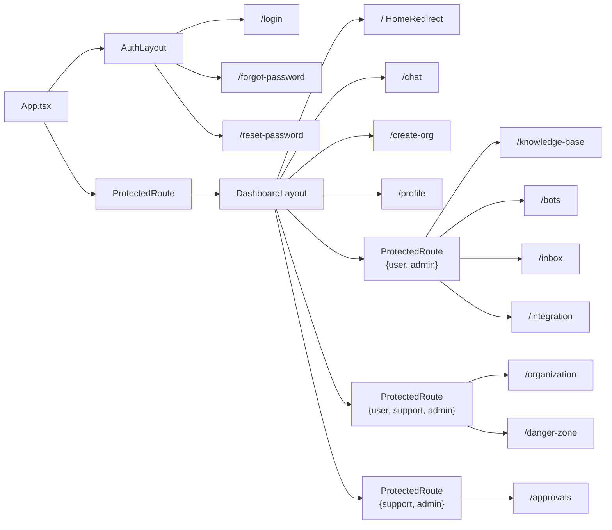

---

## 2. Authentication Flow (ขั้นตอนยืนยันตัวตน)

### 2.1 Register (สมัครใช้งาน)

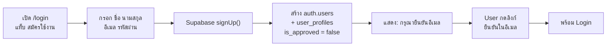

### 2.2 Login (เข้าสู่ระบบ)

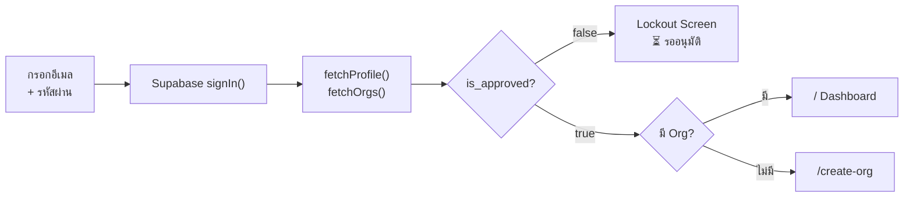

### 2.3 Password Reset (รีเซ็ตรหัสผ่าน)

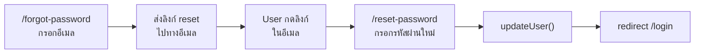

---

## 3. Approval Flow (ระบบอนุมัติผู้ใช้)

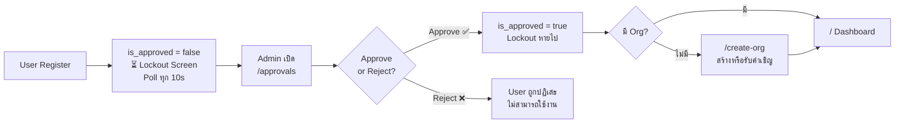

---

## 4. Navigation Structure (โครงสร้างเมนู)

### 4.1 Sidebar Layout

```
┌──────────────────────────────┐
│  🍨 SUNDAE                   │  Brand logo
│                              │
│  ┌──────────────────────┐    │
│  │ 🏢 Org Name     ▼   │    │  Org Switcher dropdown
│  └──────────────────────┘    │
│                              │
│  📊 Dashboard                │  ต้องเป็น Org Owner
│  📚 Knowledge Base           │  user/admin + Owner
│  🤖 Bots                     │  user/admin + Owner
│  📨 Inbox                    │  user/admin + Owner
│  🔗 Integration              │  user/admin + Owner
│  ⚙️ Organization             │  ทุก role + Owner
│  ✅ Approvals                │  support/admin เท่านั้น
│  💬 Web Chat                 │  ทุก role
│  👤 Profile                  │  ทุก role
│  ⚠️ Danger Zone              │  ทุก role + Owner
│                              │
│  ┌──────────────────────┐    │
│  │ 👤 ชื่อ-นามสกุล       │    │  User card
│  │ 📧 email@example.com │    │
│  │ 🟡 Admin             │    │  Role badge
│  │ [Logout]             │    │
│  └──────────────────────┘    │
└──────────────────────────────┘
```

### 4.2 Header Bar

```
┌────────────────────────────────────────────────┐
│  ☰  หน้าปัจจุบัน          🟢 Online  [TH|EN]  │
└────────────────────────────────────────────────┘
     │                         │         │
     Hamburger (mobile)   Connection   Language Toggle
```

### 4.3 Sidebar States พิเศษ

| State | แสดงอะไร |
|-------|---------|
| **Unapproved** (is_approved=false) | Sidebar ว่างเปล่า + "⏳ รออนุมัติ" + ปุ่ม Logout เท่านั้น |
| **Approved แต่ไม่มี Org** | Auto-redirect ไป `/create-org` |
| **Staff ดู Org ภายนอก** (B2B Guard) | เห็นแค่ `/danger-zone` — route อื่นถูก redirect |

---

## 5. Role-Based Access Matrix

### 5.1 Platform Roles (user_profiles.role)

| Role | Description |
|------|-------------|
| `user` | ผู้ใช้ทั่วไป — สร้าง Org ได้, จัดการ KB/Bots/Inbox ถ้าเป็น Owner |
| `support` | เจ้าหน้าที่ support — เข้าถึง Approvals, ดู Org ภายนอกได้ (B2B Guard) |
| `admin` | ผู้ดูแลระบบ — เข้าถึงทุกอย่าง |

### 5.2 Org Roles (org_members.org_role)

| Role | Description |
|------|-------------|
| `owner` | เจ้าของ Org — จัดการสมาชิก, KB, Bots, Inbox, ตั้งค่าทั้งหมด |
| `member` | สมาชิก — ใช้ Chat (`/chat`) เท่านั้น |

### 5.3 Access Matrix

| Route | User (Owner) | User (Member) | Support | Admin |
|-------|:---:|:---:|:---:|:---:|
| `/` Dashboard | ✅ | ❌ → `/chat` | ✅ | ✅ |
| `/chat` | ✅ | ✅ | ✅ | ✅ |
| `/knowledge-base` | ✅ | ❌ | ❌ | ✅ |
| `/bots` | ✅ | ❌ | ❌ | ✅ |
| `/inbox` | ✅ | ❌ | ❌ | ✅ |
| `/integration` | ✅ | ❌ | ❌ | ✅ |
| `/organization` | ✅ | ❌ | ✅ | ✅ |
| `/approvals` | ❌ | ❌ | ✅ | ✅ |
| `/profile` | ✅ | ✅ | ✅ | ✅ |
| `/danger-zone` | ✅ | ❌ | ⚠️ | ✅ |
| `/create-org` | ✅ | ✅ | ✅ | ✅ |

> ⚠️ Support ดู Org ภายนอก: ถูก redirect ไป `/danger-zone` เท่านั้น (B2B Privacy Guard)

---

## 6. User Journeys (เส้นทางผู้ใช้)

### Journey A: ผู้ใช้ใหม่ → อนุมัติ → Dashboard

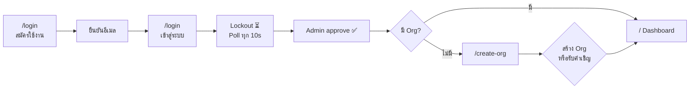

### Journey B: Admin สร้าง Organization

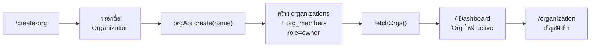

### Journey C: ผู้ใช้รับคำเชิญเข้า Org

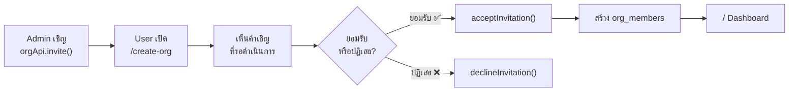

### Journey D: สมาชิกใช้ Chat Bot

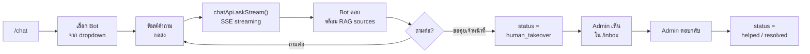

### Journey E: จัดการสมาชิก Organization

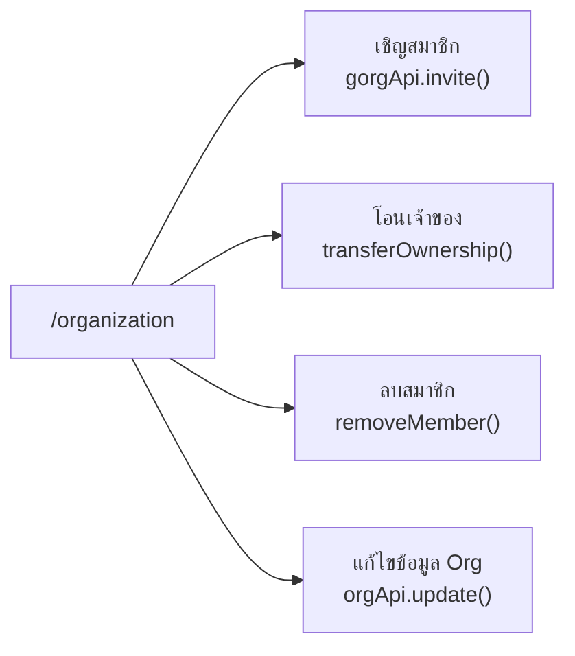

### Journey F: Support ดู Org ภายนอก (B2B Guard)

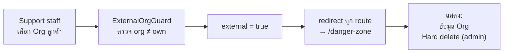

---

## 7. Chat & Inbox Flow

### 7.1 Chat Session Lifecycle

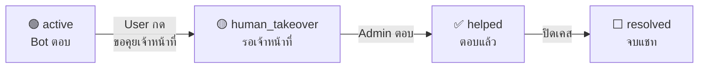

### 7.2 Inbox (Admin View)

```
┌─────────────────────────────────────────────────┐
│  Inbox                                          │
│                                                 │
│  ┌─────────────────┐  ┌──────────────────────┐  │
│  │ Session List     │  │ Chat View            │  │
│  │                  │  │                      │  │
│  │ 🟢 สมชาย (active)│  │ [ประวัติข้อความ]      │  │
│  │ 🟡 สมหญิง (human)│  │                      │  │
│  │ ✅ User3 (helped)│  │ Bot: สวัสดีครับ...     │  │
│  │ ⬜ User4 (closed)│  │ User: ขอถามเรื่อง...  │  │
│  │                  │  │ Bot: จากเอกสาร...     │  │
│  │ [ค้นหา...]       │  │                      │  │
│  │ [Filter ▼]       │  │ ┌──────────────────┐ │  │
│  │                  │  │ │ พิมพ์ตอบกลับ...    │ │  │
│  │ Platform:        │  │ └──────────────────┘ │  │
│  │ 📱 LINE          │  │                      │  │
│  │ 💬 Web           │  │ [เปลี่ยนสถานะ ▼]     │  │
│  └─────────────────┘  └──────────────────────┘  │
└─────────────────────────────────────────────────┘
```

---

## 8. Bot & Knowledge Base Management

### 8.1 สร้าง Bot

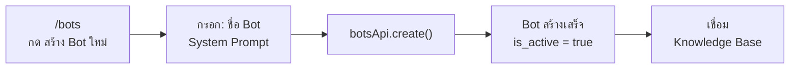

### 8.2 อัปโหลดเอกสาร → RAG Index

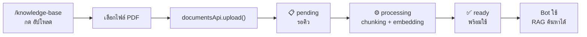

### 8.3 เชื่อม Bot กับ Platform

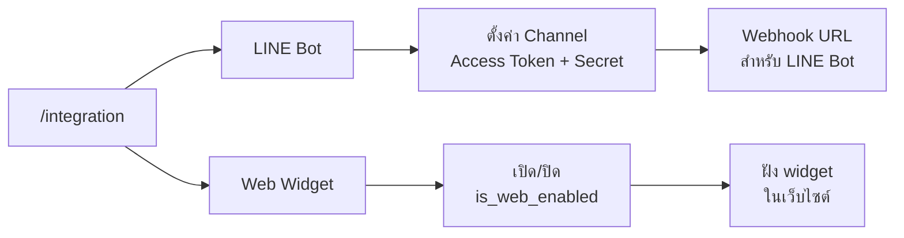

---

## 9. Organization Lifecycle

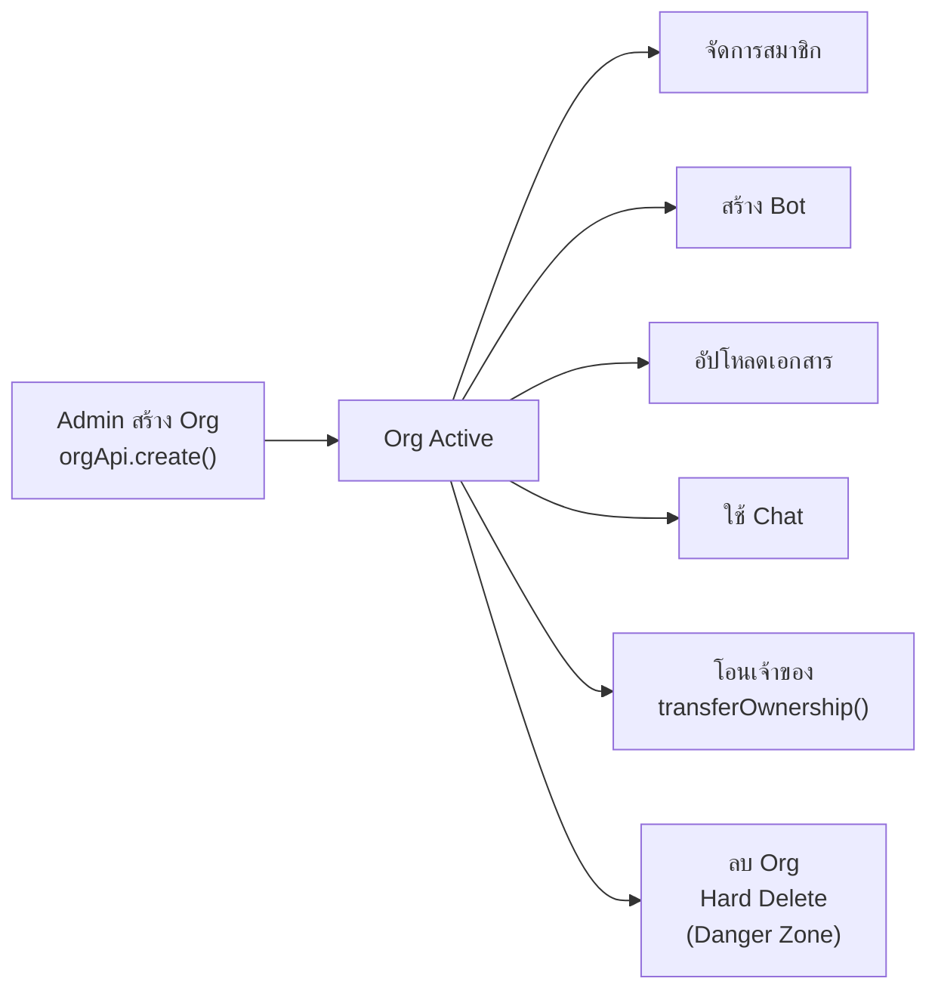

---

## 10. State Management Overview

### 10.1 App Initialization

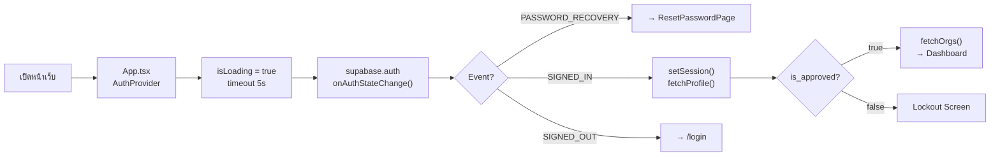

### 10.2 Stores

| Store | Key State | Persistence |
|-------|-----------|-------------|
| **authStore** | user, session, isAuthenticated, isLoading | Supabase session (cookie) |
| **orgStore** | orgs[], activeOrgId, activeOrgRole | localStorage (`ACTIVE_ORG_KEY`) |
| **localeStore** | locale ("th" \| "en") | localStorage (`sundae_locale`) |
| **toastStore** | toasts[] | Memory only |

---

## 11. Platform Integration Flow

### LINE Bot

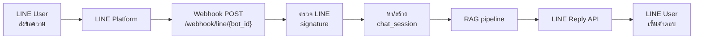

### Web Widget

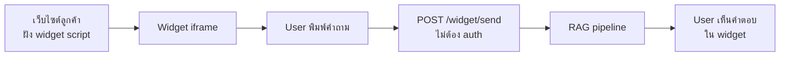

---

## 12. Error & Edge Cases

| สถานการณ์ | พฤติกรรม |
|-----------|---------|
| Session หมดอายุ | axios interceptor → redirect `/login` |
| API 401 | refreshToken → ถ้าไม่ได้ → redirect `/login` |
| API 403 | แสดง toast error |
| Network offline | Request fail → toast error |
| User ยังไม่ยืนยันอีเมล | Login fail → "กรุณายืนยันอีเมลก่อน" |
| User ถูก reject | ไม่สามารถ login ได้ |
| Org ถูกลบ | redirect `/create-org` |
| Multiple tabs | localStorage sync (อาจมี race condition) |

---

## 13. i18n (ระบบภาษา)

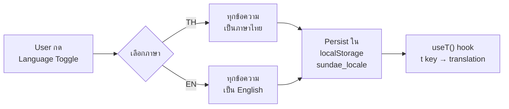

---

*Document generated — 2026-03-29*
