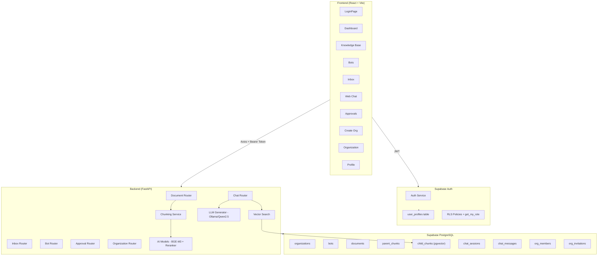
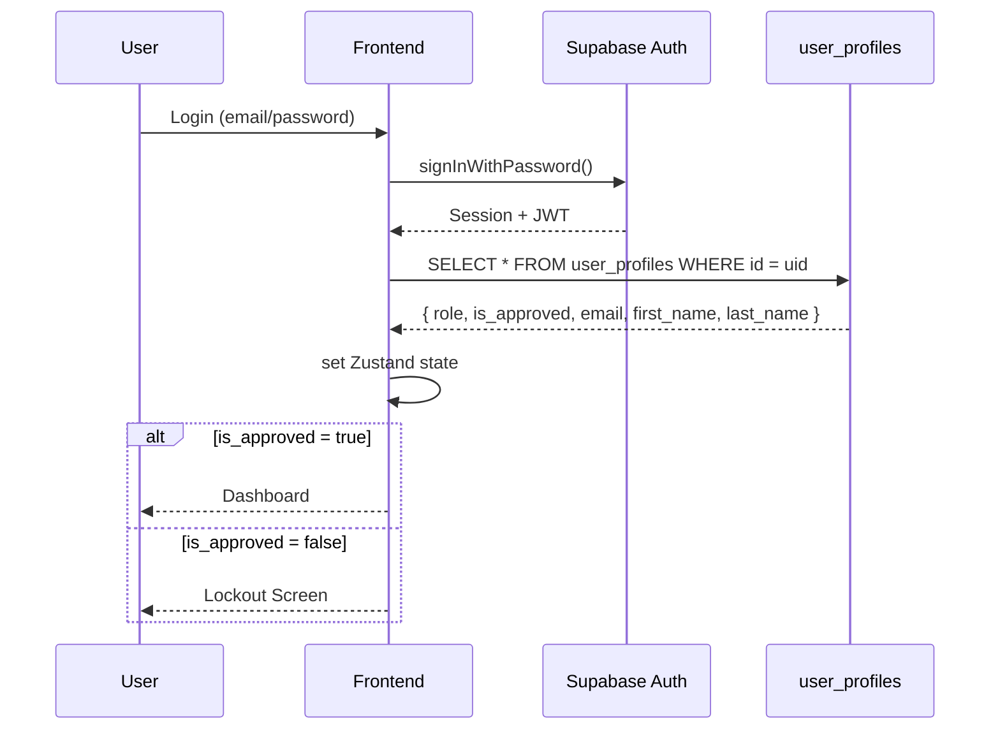
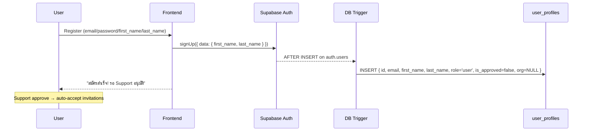

# SUNDAE — รายงานสรุปโปรเจกต์ฉบับเต็ม

> **วันที่รายงานครั้งแรก**: 25 กุมภาพันธ์ 2569
> **อัพเดทล่าสุด**: 21 มีนาคม 2569
> **Project**: SUNDAE — Enterprise AI Chatbot Platform
> **Stack**: FastAPI + React + Supabase + Ollama

---

## 1. ภาพรวมสถาปัตยกรรม (Architecture)


```mermaid
flowchart TB
    subgraph Frontend ["Frontend (React + Vite)"]
        LP[LoginPage]
        DP[Dashboard]
        KB[Knowledge Base]
        BT[Bots]
        IX[Inbox]
        WC[Web Chat]
        AP[Approvals]
        CO[Create Org]
        ORG_P[Organization]
        PR[Profile]
    end

    subgraph Auth ["Supabase Auth"]
        SA[Auth Service]
        UP[user_profiles table]
        RLS[RLS Policies + get_my_role]
    end

    subgraph Backend ["Backend (FastAPI)"]
        DR[Document Router]
        CR[Chat Router]
        IR[Inbox Router]
        BR[Bot Router]
        APR[Approval Router]
        OGR[Organization Router]
        CS[Chunking Service]
        AI[AI Models - BGE-M3 + Reranker]
        VS[Vector Search]
        LLM[LLM Generator - Ollama/Qwen2.5]
    end

    subgraph DB ["Supabase PostgreSQL"]
        ORG[organizations]
        BOT[bots]
        DOC[documents]
        PC[parent_chunks]
        CC["child_chunks (pgvector)"]
        CSS[chat_sessions]
        CM[chat_messages]
        OM[org_members]
        OI[org_invitations]
    end

    Frontend -->|JWT| Auth
    Frontend -->|Axios + Bearer Token| Backend
    Backend --> DB
    Auth --> UP
    CR --> VS --> CC
    CR --> LLM
    DR --> CS --> AI
```

---

## 2. Backend (FastAPI + Python)

### 2.1 Project Structure ✅

```
backend/
├── app/
│   ├── main.py              # FastAPI app + CORS
│   ├── core/
│   │   ├── config.py         # Settings from .env
│   │   ├── auth.py           # JWT middleware (get_current_user, require_approved, require_role, require_org_owner)
│   │   └── database.py       # Supabase async client (service role)
│   ├── routers/
│   │   ├── document.py       # Upload, list, delete (owner-only writes)
│   │   ├── chat.py           # Omnichannel (Web + LINE) + streaming SSE
│   │   ├── inbox.py          # Session management + human handoff
│   │   ├── bot.py            # Bot CRUD (owner-only writes)
│   │   ├── approval.py       # Pending user approval (support/admin)
│   │   ├── organization.py   # Org CRUD, members, invitations, deletion
│   │   └── health.py
│   ├── services/
│   │   ├── chunking.py       # Thai text splitter
│   │   ├── ai_models.py      # Embedding + Reranker
│   │   ├── vector_search.py  # Supabase RPC search
│   │   └── llm_generator.py  # Ollama/Qwen2.5
│   └── models/               # Pydantic schemas
├── sql/
│   ├── 001_schema.sql        # Full DB schema
│   ├── 002_add_missing_columns.sql
│   ├── 003_user_profiles_rls.sql
│   ├── 004_auth_trigger.sql
│   ├── 005_create_support_account.sql
│   ├── 006_match_chunks_bot_filter.sql
│   ├── 007_admin_role.sql
│   ├── 008_fix_organizations_rls.sql
│   ├── 009_fix_user_profiles_rls_update.sql
│   ├── 010_add_helped_status.sql
│   ├── 011_multi_tenant_migration.sql
│   ├── 012_simplify_auth_trigger.sql
│   ├── 013_add_page_columns.sql
│   ├── 014_split_fullname.sql
│   └── seed_accounts.sql
└── requirements.txt
```

### 2.2 Database Schema ✅

| Table | Primary Key | สำคัญ |
|-------|------------|-------|
| `organizations` | UUID | Multi-tenant root |
| `user_profiles` | UUID (FK → auth.users) | role, is_approved, email, **first_name**, **last_name**, organization_id |
| `org_members` | UUID | **user_id, organization_id, org_role** (owner/member) — many-to-many |
| `bots` | UUID | prompt, line_access_token, is_web_enabled |
| `documents` | UUID | file_path, status, FK → bots |
| `document_parent_chunks` | UUID | content, metadata |
| `document_child_chunks` | UUID | **embedding vector(1024)**, FK → parent |
| `chat_sessions` | UUID | platform_source, status |
| `chat_messages` | UUID | role, content, FK → session |
| `org_invitations` | UUID | **organization_id, invited_email, invited_by, status** (pending/accepted/revoked) |

RPC Function: `match_child_chunks` — cosine similarity search บน pgvector

### 2.3 AI Services ✅

| Service | Model | หน้าที่ |
|---------|-------|--------|
| Embedding | BAAI/bge-m3 (1024 dims) | แปลงข้อความเป็น vector |
| Reranker | BAAI/bge-reranker-v2-m3 | จัดลำดับผลลัพธ์ |
| LLM | Ollama/qwen2.5:3b ⚠️ | สร้างคำตอบจาก context (ดูหมายเหตุ) |
| Chunking | Custom Thai Splitter | ตัด text เป็น parent/child chunks |

### 2.4 Auth Middleware (core/auth.py)

```
get_current_user      → ตรวจ Bearer token → verify ผ่าน supabase.auth.get_user() (รองรับทุก JWT algorithm)
                      → profile cache (5 min TTL) → ถ้า miss ดึง user_profiles จาก DB
                      → อ่าน X-Active-Org header → set active_org_id
require_approved      → เช็ค is_approved = true → 403 ถ้าไม่ผ่าน
require_role(...)     → เช็ค platform role + is_approved → 403 ถ้าไม่ผ่าน
require_org_owner     → เช็ค org_members.org_role = 'owner' สำหรับ active_org → 403 ถ้าไม่ผ่าน (admin bypass)
verify_organization() → async — ตรวจว่า user เป็นสมาชิก org ใน org_members (admin bypass)
```

> **หมายเหตุ JWT**: Supabase project ของเรา (`bzotgjsbuiuotyknjpfv`) ออก JWT ด้วย **ES256** (ECDSA) ไม่ใช่ HS256
> ดังนั้นจึงใช้ `supabase.auth.get_user(token)` แทน local `jwt.decode()` — ตรงกับ reference project

Backend ใช้ **Service Role Key** — bypass RLS ทั้งหมด ทำให้อ่านค่า `is_approved` จริงจาก DB เสมอ

---

## 3. Frontend (React + Vite + Tailwind v4)

### 3.1 Project Structure ✅

```
frontend/src/
├── api/
│   ├── supabaseClient.ts    # Singleton Supabase client (custom lock, periodic refresh)
│   ├── axios.ts             # JWT interceptor (3 layers)
│   └── endpoints.ts         # API calls (documents, chat, inbox, bots, admin, org)
├── store/
│   ├── authStore.ts         # Zustand (signIn/signOut/fetchProfile)
│   ├── orgStore.ts          # Zustand (multi-org state, activeOrgId, fetchOrgs)
│   └── toastStore.ts        # Toast notification state
├── types/
│   └── index.ts             # TypeScript interfaces (synced DB)
├── components/
│   ├── ProtectedRoute.tsx   # Role guard
│   ├── OrgSwitcher.tsx      # Sidebar org dropdown for multi-org
│   ├── Spinner.tsx          # Shared loading spinner
│   └── ToastContainer.tsx   # Global toast UI
├── layouts/
│   ├── DashboardLayout.tsx  # Sidebar + approval lockout
│   └── AuthLayout.tsx       # Login background
├── pages/
│   ├── LoginPage.tsx           # Login + Registration tabs
│   ├── ForgotPasswordPage.tsx  # ขอลิงก์ reset password ทาง email
│   ├── ResetPasswordPage.tsx   # ตั้งรหัสผ่านใหม่จากลิงก์ email
│   ├── DashboardPage.tsx       # 3 role-based states
│   ├── WebChatPage.tsx         # Chat interface + streaming + cancel button
│   ├── ApprovalsPage.tsx       # Admin/Support approval list (backend API)
│   ├── CreateOrgPage.tsx       # Create org + accept invitations (post-approval)
│   ├── OrganizationPage.tsx    # Org settings, members, invites, deletion
│   ├── KnowledgeBasePage.tsx
│   ├── BotsPage.tsx
│   ├── InboxPage.tsx           # Human handoff inbox (admin perspective)
│   └── IntegrationPage.tsx
├── App.tsx                  # AuthProvider + Routing
├── index.css                # NT CI Design System
└── main.tsx                 # Entry point
```

### 3.2 Token Protection Strategy (axios.ts) ✅

3 layers ป้องกัน token หมดอายุ:

```
Layer 1 (Request Interceptor) → getValidToken()
  → อ่าน session จาก cache
  → ถ้า expires_at - now < 300s (5 นาที) → refreshSession() ก่อน
  → ส่ง token ใหม่ทุก request

Layer 2 (Response Interceptor) → retry on 401
  → ถ้าได้ 401 → refreshTokenOnce() → retry request อีกครั้ง
  → ถ้า refresh fail → toast "เซสชันหมดอายุ" → redirect /login

Layer 3 (supabaseClient.ts)
  → Periodic refresh ทุก 30 นาที
  → Refresh เมื่อ tab กลับมา focus (หลังห่างไป 5 นาที)
```

**Mutex**: `refreshPromise` ป้องกัน concurrent refresh ที่จะ invalidate refresh token

### 3.3 บั๊ก JWT หมดอายุแล้วหน้าเว็บค้าง (401) — Patch Summary ✅

**อาการที่พบ**

- **[อาการ]** เปิดหน้าเว็บทิ้งไว้สักพัก → เริ่มกดใช้งานต่อไม่ได้/ส่งแชทไม่ได้ → Network ขึ้น `401 Unauthorized` หลาย endpoint พร้อมกัน
- **[อาการ]** ในหน้า Web Chat จะเห็น error เช่น `Not authenticated` และบางครั้งเหมือน UI “ค้าง” จนต้องกด Refresh เพื่อให้โหลด token ใหม่

**สาเหตุหลัก (Root Cause)**

- **[สาเหตุ]** เส้นทาง SSE streaming (`chatApi.askStream`) ใช้ `fetch` (ไม่ผ่าน axios interceptor)
- **[สาเหตุ]** การดึง session/token จาก Supabase (`getSession()`/`refreshSession()`) เคยมีโอกาส “ค้าง/ไม่ตอบกลับ” หรือคืน `session = null` หลัง idle/sleep/network ทำให้ไม่มี `Authorization` header แล้ว API 401 รัว ๆ
- **[ผล]** UI ฝั่งหน้าแชทตั้ง `isLoading=true` แล้วรอ callback (`onDone/onError`) หากโค้ดค้างก่อนเรียก callback จะดูเหมือนหน้าเว็บค้าง

**สิ่งที่แก้ไข (ไฟล์ + พฤติกรรม)**

- **[frontend/src/api/axios.ts]**
  - เพิ่ม timeout (`withTimeout` 10s) ครอบ `supabase.auth.getSession()` และ `supabase.auth.refreshSession()` เพื่อกัน await ค้าง
  - export `refreshTokenOnce()` เพื่อให้ flow ที่ไม่ได้ใช้ axios (SSE) reuse refresh mutex เดียวกัน

- **[frontend/src/api/endpoints.ts]** (เฉพาะ `chatApi.askStream`)
  - ถ้า `getValidToken()` ได้ `null` → toast “เซสชันหมดอายุ” → redirect `/login` (ไม่ต้องกด Refresh เอง)
  - ถ้า `fetch` ได้ `401` → `refreshTokenOnce()` → retry 1 ครั้ง
  - ถ้า refresh fail → toast + redirect `/login`

- **[frontend/src/api/supabaseClient.ts]** (Token keep-alive)
  - เพิ่ม timeout 10s ครอบ `getSession()`/`refreshSession()`
  - เพิ่ม mutex `refreshPromise` กัน refresh ซ้อน
  - เพิ่ม fail-safe: ถ้า `session` เป็น `null` หรือ refresh fail ต่อเนื่อง (>= 2 ครั้ง) → `signOut()` + ล้าง key `sb-*` + redirect `/login`

**ผลลัพธ์ที่คาดหวังหลังแก้**

- **[expected]** ถ้า access token หมดอายุแต่ refresh ยังใช้ได้ → ระบบ refresh แล้วใช้งานต่อเนื่องได้
- **[expected]** ถ้า refresh token ตาย/ได้ session = null → ระบบจะเด้งไป `/login` อัตโนมัติ (ไม่ค้าง และไม่ต้อง Refresh หน้าเอง)

**วิธีทดสอบ**

- **[ทดสอบ]** เปิด `/chat` ทิ้งไว้จน token ใกล้หมดอายุ แล้วลองส่งข้อความ
- **[ทดสอบ]** สลับเน็ต/ปล่อยเครื่อง sleep แล้วกลับมา ลองส่งข้อความ
- **[ทดสอบ]** ดูใน Network ว่าถ้ามี `401` จะ redirect ไป `/login` และไม่ค้างหน้าเดิม

---

### 3.4 Admin Inbox Realtime + สถานะช่วยเหลือเรียบร้อย (helped) — Patch Summary ✅

**เป้าหมาย**

- **[เป้าหมาย]** เมื่อผู้ใช้กดเรียก Admin → หน้า Inbox ของ Admin ต้องเห็น session ใหม่/ข้อความใหม่แบบอัตโนมัติ
- **[เป้าหมาย]** Admin กด “รับเรื่อง” แล้วคุยแทน bot ได้ทันที
- **[เป้าหมาย]** เปลี่ยนปุ่ม “ปิดเคส” เป็น “ช่วยเหลือเรียบร้อย” เพื่อไม่ล็อก user (ยังใช้งานแชทเดิม + เรียก admin ได้อีก)

**สิ่งที่แก้ไข (ไฟล์ + พฤติกรรม)**

- **[frontend/src/pages/InboxPage.tsx]**
  - เพิ่ม polling:
    - session list ทุก 3s (silent refresh ไม่กระพริบ loading)
    - new messages ทุก 2s ผ่าน `/api/inbox/sessions/{id}/messages/new`
  - เพิ่มสถานะ `helped` (label: “ช่วยเหลือเรียบร้อย”) และเปลี่ยนปุ่มจาก “ปิดเคส” → “ช่วยเหลือเรียบร้อย”

- **[frontend/src/pages/WebChatPage.tsx]**
  - `helped` ถือว่า “ยังใช้งานได้” เหมือน `active`:
    - input ไม่ถูกปิด
    - user ยังสามารถกด “ขอพูดคุยกับเจ้าหน้าที่” ได้
  - ถ้า backend เปลี่ยนสถานะเป็น `helped` จะขึ้น system message แจ้งว่า “ช่วยเหลือเรียบร้อยแล้ว…“

- **[frontend/src/types/index.ts]**
  - เพิ่ม `SessionStatus = "active" | "human_takeover" | "helped" | "resolved"`

- **[backend/app/routers/inbox.py]**
  - เพิ่ม `helped` ในสถานะที่อนุญาตสำหรับ update status
  - ปรับ behavior: ถ้า session เป็น `helped` แล้ว admin ส่งข้อความ → auto กลับไป `human_takeover`

**SQL ที่ต้องรันเพิ่ม (สำคัญ)**

- **[backend/sql/010_add_helped_status.sql]**
  - อัปเดต `CHECK constraint` ของ `chat_sessions.status` ให้รองรับค่า `helped`

---

### 3.5 สลับหน้า Bots → Inbox แล้วค้าง/เด้งกลับ Dashboard — Patch Summary ✅

**อาการที่พบ**

- **[อาการ]** สลับหน้าจาก `Bots` ไป `Inbox` → หน้า Inbox โหลดไม่ขึ้น/ใช้งานไม่ได้ จนต้องกด Refresh
- **[อาการ]** บางครั้งรอสักพักแล้วเหมือน “refresh เอง” และ/หรือถูกพากลับไปหน้า Dashboard

**สาเหตุหลัก (Root Cause)**

- **[สาเหตุ]** `/inbox` เป็น route ที่จำกัดสิทธิ์ (admin-only)
- **[สาเหตุ]** ตอน navigate ข้ามหน้า บางจังหวะ `isAuthenticated = true` แล้ว แต่ `user.role` ยังไม่ถูกโหลด (กำลัง `fetchProfile()`)
- **[ผล]** Route guard ประเมิน role เป็น `undefined` ชั่วคราว ทำให้เกิด routing ที่ไม่เสถียร/ค้าง/ต้อง refresh เพื่อให้ state กลับมาครบ

**วิธีแก้ (ไฟล์ + พฤติกรรม)**

- **[frontend/src/components/ProtectedRoute.tsx]**
  - ถ้า route มี `allowedRoles` แต่ `role` ยังไม่มา → แสดง loading state “กำลังโหลดสิทธิ์การใช้งาน...”
  - รอจน role โหลดเสร็จแล้วค่อยตัดสินใจอนุญาต/redirect

## 4. Supabase Auth Integration

### 4.1 Auth Flow


```mermaid
sequenceDiagram
    participant U as User
    participant FE as Frontend
    participant SB as Supabase Auth
    participant DB as user_profiles

    U->>FE: Login (email/password)
    FE->>SB: signInWithPassword()
    SB-->>FE: Session + JWT
    FE->>DB: SELECT * FROM user_profiles WHERE id = uid
    DB-->>FE: { role, is_approved, email, first_name, last_name }
    FE->>FE: set Zustand state
    alt is_approved = true
        FE-->>U: Dashboard
    else is_approved = false
        FE-->>U: Lockout Screen
    end
```

### 4.2 Registration Flow (Multi-tenant)


```mermaid
sequenceDiagram
    participant U as User
    participant FE as Frontend
    participant SB as Supabase Auth
    participant TR as DB Trigger
    participant DB as user_profiles

    U->>FE: Register (email/password/first_name/last_name)
    FE->>SB: signUp({ data: { first_name, last_name } })
    SB-->>TR: AFTER INSERT on auth.users
    TR->>DB: INSERT { id, email, first_name, last_name, role='user', is_approved=false, org=NULL }
    FE-->>U: "สมัครสำเร็จ! รอ Support อนุมัติ"
    Note over U: Support approve → auto-accept invitations
```

**กรณี Invite Link**: ถ้า URL มี `?invite_org=<uuid>` → trigger จะ set `invite_org_id` แทน `desired_org_name` → Support approve → assign เป็น member ขององค์กรนั้น

---

## 5. RLS Security (Row Level Security)

### 5.1 Policies ปัจจุบัน (Final Version — migration 009)

```sql
-- Helper function (SECURITY DEFINER = bypass RLS ป้องกัน infinite recursion)
CREATE FUNCTION get_my_role() RETURNS TEXT
SECURITY DEFINER AS $$
    SELECT role FROM user_profiles WHERE id = auth.uid();
$$;

-- SELECT: ตัวเอง + Support/Admin ดูทุกคน
USING (id = auth.uid() OR get_my_role() IN ('support','admin'))

-- UPDATE: เฉพาะ Support/Admin (ป้องกัน privilege escalation)
-- มีทั้ง USING และ WITH CHECK (migration 009 เพิ่ม WITH CHECK)
USING (get_my_role() IN ('support','admin'))
WITH CHECK (get_my_role() IN ('support','admin'))

-- INSERT: สมัครสมาชิก (id ต้อง = auth.uid)
WITH CHECK (id = auth.uid())
```

### 5.2 Organizations RLS (migration 008)

```sql
-- แก้จาก org_isolation ที่ใช้ JWT claim ที่ไม่มีอยู่จริง
CREATE POLICY "org_read_own" ON organizations
    FOR SELECT USING (
        id IN (SELECT organization_id FROM user_profiles WHERE id = auth.uid())
    );
```

---

## 6. Bugs ที่พบ & แก้ไขแล้ว

| # | Bug | สาเหตุ | วิธีแก้ | ไฟล์ |
|---|-----|--------|---------|------|
| B1 | Loading screen ค้าง | ไม่มี `.catch()` + ไม่มี timeout | เพิ่ม `.catch()` + 5s timeout | `App.tsx` |
| B2 | user_profiles ไม่มี email/full_name | ขาด columns | เพิ่ม columns + sync types | `002_add_missing_columns.sql` |
| B3 | RLS blocks profile read | Policy ไม่มี SELECT สำหรับตัวเอง | เพิ่ม `id = auth.uid()` | `003_user_profiles_rls.sql` |
| B4 | RLS infinite recursion | Subquery ใน policy อ่าน user_profiles ซ้ำ | สร้าง `get_my_role()` SECURITY DEFINER | `003_user_profiles_rls.sql` |
| B5 | Stream ไม่ยิง request (Network ว่าง) | `import("./supabaseClient")` แบบ dynamic แฮงค์ใน Vite build | เปลี่ยนเป็น static import ที่ top | `endpoints.ts` |
| B6 | Organizations 406 Not Acceptable | RLS policy `org_isolation` ใช้ `auth.jwt() ->> 'organization_id'` ที่ไม่มีใน Supabase JWT | สร้าง policy ใหม่ใช้ subquery | `008_fix_organizations_rls.sql` |
| B7 | "Failed to fetch" บน Login | `signIn()` ไม่มี `catch` block | เพิ่ม `catch` + Thai error message | `authStore.ts` |
| B8 | User role 403 บน Inbox endpoints | `is_approved = false` ใน DB แม้ Admin กด approve แล้ว | RLS UPDATE policy ขาด `WITH CHECK` + approve ไม่ check rows affected | `009_fix_user_profiles_rls_update.sql`, `ApprovalsPage.tsx` |
| B9 | Stream หยุดทำงานหลังผ่านไปสักพัก | `askStream` ใช้ `getSession()` ดิบ ไม่เช็ค expiry ไม่ refresh token | เปลี่ยนเป็น `getValidToken()` ที่ export จาก axios.ts | `endpoints.ts`, `axios.ts` |
| B10 | Ollama unload model หลัง idle 30 นาที → stream ค้าง | `keep_alive: "30m"` → model ถูก unload → reload นาน → Network graph ว่าง | เพิ่มเป็น `keep_alive: "4h"` | `llm_generator.py` |
| B11 | Inbox Admin view: ข้อความ layout ผิด | ใช้ perspective ของ "user" — `user` messages ชิดขวา, `assistant` ชิดซ้าย | เปลี่ยนเป็น Admin perspective: user (ลูกค้า) ซ้าย, assistant+admin ขวา | `InboxPage.tsx` |

---

## 7. การแก้ไขสำคัญในรอบนี้ (มีนาคม 2569)

### 7.1 Stream Token Fix (B9)

**ปัญหา**: หลังใช้งานสักพัก JWT หมดอายุ แต่ `askStream` ใช้ `supabase.auth.getSession()` ดิบ → ได้ expired token → backend 401 → stream ล้มเหลว

**วิธีแก้**:
- Export `getValidToken()` จาก `axios.ts` (เดิมเป็น private function)
- `askStream` ใน `endpoints.ts` เปลี่ยนมาใช้ `getValidToken()` แทน
- ทำให้ stream ใช้ระบบ refresh เดียวกับ axios ทุก request (เช็ค expiry + refresh อัตโนมัติ)

```typescript
// ก่อน (ไม่เช็ค expiry)
const { data: { session } } = await supabase.auth.getSession();
token = session?.access_token;

// หลัง (auto-refresh ถ้าใกล้หมดอายุ)
const token = await getValidToken();
```

### 7.2 Ollama Keep-Alive Fix (B10)

**ปัญหา**: `keep_alive: "30m"` → Ollama unload model ออกจาก RAM หลัง idle 30 นาที → request ถัดไปต้อง reload model → ระหว่างนั้น Network graph ว่างเปล่า user คิดว่าระบบพัง

**วิธีแก้**: เปลี่ยน `keep_alive: "4h"` ใน `llm_generator.py` ทั้ง 2 ที่ (non-stream และ stream)

### 7.3 ApprovalsPage Silent Failure Fix (B8)

**ปัญหา**: Supabase UPDATE ที่ถูก RLS block จะ return `{ data: [], error: null }` — ไม่มี error แต่ไม่มี row ถูก update จริง Frontend ไม่รู้ว่าล้มเหลว

**วิธีแก้**: เพิ่ม `.select()` หลัง `.update()` → ถ้า `data.length === 0` → แสดง error toast "RLS policy blocked"

```typescript
// ก่อน (ไม่รู้ว่า update สำเร็จจริงไหม)
const { error } = await supabase.from("user_profiles").update({ is_approved: true }).eq("id", userId);

// หลัง (ตรวจสอบจริง)
const { data, error } = await supabase.from("user_profiles")
    .update({ is_approved: true }).eq("id", userId).select("id, is_approved");
if (!data || data.length === 0) { /* แจ้ง error */ }
```

### 7.4 RLS UPDATE WITH CHECK Fix (migration 009)

**ปัญหา**: UPDATE policy มีแค่ `USING` แต่ไม่มี `WITH CHECK` → พฤติกรรมอาจไม่ชัดเจนใน PostgreSQL

**วิธีแก้**: เพิ่ม `WITH CHECK (get_my_role() IN ('support', 'admin'))` และมี SQL สำหรับ approve user โดยตรงด้วย

### 7.5 Inbox Admin Perspective Fix (B11)

**ปัญหา**: `InboxPage.tsx` render messages ด้วย perspective ของ "user" — ข้อความ `role: "user"` (ลูกค้า) ชิดขวา แทนที่จะชิดซ้าย

**วิธีแก้**: เปลี่ยน layout logic เป็น Admin perspective:

| Role | ตำแหน่ง | สี | Avatar |
|---|---|---|---|
| `user` (ลูกค้า) | **ซ้าย** | ขาว + border | U (เทา) |
| `assistant` (AI SUNDAE) | **ขวา** | เหลืองอ่อน (brand) | S (เหลือง) |
| `admin` (เจ้าหน้าที่) | **ขวา** | น้ำเงิน | A (น้ำเงิน) |
| `system` | **กลาง** | แบนเนอร์เหลือง | — |

### 7.6 Cleanup ก่อน Push ไป GitHub

ลบไฟล์ test/dummy ออกทั้งหมด + เพิ่ม `.gitignore`:

**ลบ**:
- `docker_out.txt`, `dummy.docx`, `dummy.pdf`
- `test_results*.txt/json` ทั้งหมด (root + frontend)
- `test_backend_*.py` (root level)
- `frontend/e2e*.spec.ts`, `frontend/playwright.config.ts`
- `Manual Browser Test *.md`, `Test Object.md`, `UI Test Checklist.md`, `Next Step.md`

**เพิ่มใน .gitignore**:
```
.claude/          # Claude Code session files
test-results/     # Test output directories
frontend/test-results/
```

---

## 8. ไฟล์ที่แก้ไขในรอบนี้

| ไฟล์ | การเปลี่ยนแปลง |
|------|---------------|
| `frontend/src/api/axios.ts` | Export `getValidToken()` |
| `frontend/src/api/endpoints.ts` | ใช้ `getValidToken()` แทน raw `getSession()`, ลบ supabase import |
| `frontend/src/pages/ApprovalsPage.tsx` | เพิ่ม `.select()` หลัง update + ตรวจสอบ rows affected |
| `frontend/src/pages/InboxPage.tsx` | เปลี่ยนเป็น Admin perspective (user ซ้าย, AI+admin ขวา) |
| `backend/app/services/llm_generator.py` | `keep_alive: "30m"` → `"4h"` (ทั้ง stream และ non-stream) |
| `backend/sql/008_fix_organizations_rls.sql` | แก้ RLS policy organizations |
| `backend/sql/009_fix_user_profiles_rls_update.sql` | เพิ่ม WITH CHECK + SQL approve user |
| `.gitignore` | เพิ่ม `.claude/`, `test-results/` |

---

## 9. SQL Migrations (001 → 009) — ทำอะไรบ้าง

> **หมายเหตุ**: Migration 001-007 รันไปแล้วทั้งหมด ส่วน 008-009 รันล่าสุดในรอบนี้

---

### 001 — Schema หลัก ✅ รันแล้ว

**สร้าง tables ทั้งหมดของระบบ**:

| Table | หน้าที่ |
|-------|--------|
| `organizations` | Multi-tenant root — เก็บข้อมูลองค์กร |
| ~~`users`~~ | **⚠️ Dropped (17 มี.ค. 2569)** — ไม่เคยถูกใช้จริง ถูกแทนที่โดย `user_profiles` + `org_members` ตั้งแต่ migration 003 |
| `bots` | Bot แต่ละตัวขององค์กร |
| `documents` | เอกสารที่อัพโหลด (PDF ฯลฯ) |
| `document_parent_chunks` | Chunk ขนาดใหญ่สำหรับส่งให้ LLM |
| `document_child_chunks` | Chunk เล็ก + **embedding vector(1024)** สำหรับ search |
| `chat_sessions` | Session การสนทนาแต่ละครั้ง |
| `chat_messages` | ข้อความทุกข้อในแต่ละ session |

สร้าง RPC function `match_child_chunks` สำหรับ cosine similarity search ด้วย pgvector

> **หมายเหตุ**: table `public.users` ถูก drop ออกแล้ว (17 มี.ค. 2569) เนื่องจากไม่มี backend/frontend code ใดใช้งาน — ทุก query ใช้ `user_profiles` + `org_members` แทน table นี้ไม่ใช่ `auth.users` ของ Supabase (ซึ่งยังคงอยู่ตามปกติ)

---

### 002 — เพิ่ม columns ที่ขาดหาย ✅ รันแล้ว

**ปัญหา**: หลัง schema 001 ถูก deploy แล้ว พบว่า frontend ต้องการ columns เพิ่มเติมที่ไม่มีใน schema แรก

**สิ่งที่เพิ่ม**:
```sql
-- bots table
ALTER TABLE bots ADD COLUMN line_access_token TEXT;         -- สำหรับ LINE integration
ALTER TABLE bots ADD COLUMN is_web_enabled BOOLEAN DEFAULT true;  -- เปิด/ปิด Web Chat

-- chat_sessions table
ALTER TABLE chat_sessions ADD COLUMN status TEXT            -- active | human_takeover | resolved
ALTER TABLE chat_sessions ADD COLUMN platform_source TEXT;  -- web | line | other
ALTER TABLE chat_sessions ADD COLUMN platform_user_id TEXT; -- User ID จาก platform
```

---

### 003 — user_profiles + RLS + get_my_role() ✅ รันแล้ว

**ปัญหา**: ระบบต้องการเก็บข้อมูล role และการ approve ของ user แต่ Supabase auth.users แก้ไขตรงๆ ไม่ได้

**สิ่งที่สร้าง**:

1. **Table `user_profiles`** — เชื่อมกับ `auth.users` เก็บ `role`, `is_approved`, `email`, `full_name`

2. **Function `get_my_role()`** — `SECURITY DEFINER` ป้องกัน infinite recursion ใน RLS policies:
```sql
-- ถ้าใช้ subquery ตรงๆ ใน policy จะเกิด recursion loop
-- แก้ด้วย function ที่ bypass RLS
CREATE FUNCTION get_my_role() RETURNS TEXT SECURITY DEFINER AS $$
    SELECT role FROM user_profiles WHERE id = auth.uid();
$$;
```

3. **RLS Policies**:
   - SELECT: user อ่านได้เฉพาะของตัวเอง, Support/Admin อ่านได้ทุกคน
   - UPDATE: เฉพาะ Support/Admin (ป้องกัน user เปลี่ยน role ตัวเอง)
   - INSERT: user สมัครได้เฉพาะ profile ของตัวเอง

4. **Seed admin account** (`admin@sundae.local`)

---

### 004 — Auth Trigger (Auto-create profile) ✅ รันแล้ว

**ปัญหา**: เมื่อ user สมัครสมาชิก (`signUp()`), Supabase สร้าง `auth.users` แต่ `user_profiles` ยังว่าง → RLS block ไม่ให้ user สร้าง profile ตัวเองได้เพราะ `auth.uid()` = null ระหว่างขั้นตอน email confirmation

**วิธีแก้**: สร้าง **database trigger** ที่ auto-สร้าง `user_profiles` ทันทีที่มี user ใหม่ใน `auth.users`:
```sql
CREATE TRIGGER on_auth_user_created
    AFTER INSERT ON auth.users
    FOR EACH ROW EXECUTE FUNCTION handle_new_auth_user();
-- → auto insert user_profiles (role=user, is_approved=false, organization=SUNDAE Demo Org)
```

---

### 005 — สร้าง Support Account ✅ รันแล้ว

**ปัญหา**: ต้องการ account สำหรับทีม Support ที่มี role = `support`

**วิธี**: ไม่สามารถ INSERT ตรงเข้า `auth.users` ได้ (จะทำให้ schema เสีย) ต้องใช้ Supabase Admin API สร้าง auth user ก่อน แล้วจึงรัน SQL อัพเดท role:
```sql
UPDATE user_profiles
SET role = 'support', is_approved = true, organization_id = '...'
WHERE email = 'support@sundae.local';
```

Login: `support@sundae.local` / `Sundae@2025`

---

### 006 — Bot Filter ใน Vector Search ✅ รันแล้ว

**ปัญหา**: `match_child_chunks` RPC เดิมค้นหา documents **ทั้งหมดในองค์กร** โดยไม่กรองว่า document ผูกกับ bot ไหน → Bot A อาจได้ข้อมูลจาก document ของ Bot B

**วิธีแก้**: เพิ่ม parameter `target_bot_id` ใน RPC function:
```sql
CREATE FUNCTION match_child_chunks(
    query_embedding VECTOR(1024),
    target_org_id   UUID,
    match_count     INTEGER DEFAULT 20,
    target_bot_id   UUID DEFAULT NULL  -- ← เพิ่มใหม่
)
-- ถ้าส่ง bot_id มา → กรองเฉพาะ documents ที่ผูกกับ bot นั้น
AND (target_bot_id IS NULL OR dcc.document_id IN (
    SELECT id FROM documents WHERE bot_id = target_bot_id
))
```

---

### 007 — เพิ่ม role 'admin' ใน chat_messages ✅ รันแล้ว

**ปัญหา**: เมื่อ Admin/Support ต้องการตอบกลับลูกค้าใน Inbox (Human Handoff) ระบบ error เพราะ constraint ของ `role` column ใน `chat_messages` ยอมรับแค่ `user`, `assistant`, `system`

**วิธีแก้**:
```sql
ALTER TABLE chat_messages DROP CONSTRAINT chat_messages_role_check;
ALTER TABLE chat_messages ADD CONSTRAINT chat_messages_role_check
    CHECK (role IN ('user', 'assistant', 'system', 'admin'));  -- ← เพิ่ม 'admin'
```

---

### 008 — แก้ Organizations RLS ✅ รันแล้ว (รอบนี้)

**ปัญหา**: Frontend ได้รับ HTTP 406 เมื่อ query `organizations` table เพราะ RLS policy เดิมใช้ `auth.jwt() ->> 'organization_id'` แต่ Supabase **ไม่ใส่ custom claim นี้ใน JWT** โดยอัตโนมัติ

**วิธีแก้**: เปลี่ยน policy ให้ query จาก `user_profiles` แทน:
```sql
DROP POLICY "org_isolation" ON organizations;

CREATE POLICY "org_read_own" ON organizations FOR SELECT USING (
    id IN (SELECT organization_id FROM user_profiles WHERE id = auth.uid())
);
CREATE POLICY "org_service_role" ON organizations FOR ALL USING (
    auth.role() = 'service_role'
);
```

---

### 009 — แก้ RLS UPDATE + Approve User ✅ รันแล้ว (รอบนี้)

**ปัญหา**: Admin กด "อนุมัติ" ใน ApprovalsPage แต่ `is_approved` ไม่เปลี่ยนเป็น `true` ใน DB เพราะ:
1. RLS UPDATE policy มีแค่ `USING` ไม่มี `WITH CHECK` → Supabase อาจ block แบบเงียบ
2. Frontend ไม่ตรวจสอบว่า update สำเร็จจริงหรือเปล่า

**วิธีแก้**:
```sql
-- ลบ policy เก่า แล้วสร้างใหม่พร้อม WITH CHECK
DROP POLICY "Only support/admin can update profiles" ON user_profiles;
CREATE POLICY "Only support/admin can update profiles"
ON user_profiles FOR UPDATE
USING    (get_my_role() IN ('support', 'admin'))
WITH CHECK (get_my_role() IN ('support', 'admin'));  -- ← เพิ่มใหม่

-- Approve user โดยตรง (สำรองถ้า UI ยังไม่ทำงาน)
UPDATE user_profiles SET is_approved = true
WHERE email = 'sawasdichai.amor@bumail.net' AND is_approved = false;
```

---

### สรุป Migration ทั้งหมด

| # | Migration | สถานะ | ปัญหาที่แก้ |
|---|-----------|-------|------------|
| 001 | Schema หลัก | ✅ รันแล้ว | สร้าง DB ทั้งหมด |
| 002 | เพิ่ม columns | ✅ รันแล้ว | LINE integration + session status |
| 003 | user_profiles + RLS | ✅ รันแล้ว | ระบบ role + is_approved + get_my_role() |
| 004 | Auth trigger | ✅ รันแล้ว | Auto-create profile ตอนสมัครสมาชิก |
| 005 | Support account | ✅ รันแล้ว | สร้าง Support user |
| 006 | Bot filter vector search | ✅ รันแล้ว | Bot ค้นหาเฉพาะ doc ของตัวเอง |
| 007 | Admin role in messages | ✅ รันแล้ว | Human handoff ตอบกลับได้ |
| 008 | Fix organizations RLS | ✅ รันแล้ว | แก้ 406 error บน organizations |
| 009 | Fix UPDATE RLS + approve | ✅ รันแล้ว | แก้ approve ไม่ทำงาน |
| 010 | Add helped status | ✅ รันแล้ว | เพิ่มสถานะ `helped` (ช่วยเหลือเรียบร้อย) ให้ chat_sessions.status |
| 011 | Multi-tenant migration (org_members) | ✅ รันแล้ว | สร้าง org_members, ปรับ org_invitations, drop deprecated columns (ดู Section 15) |
| 012 | Simplify auth trigger | ✅ รันแล้ว | trigger ใหม่ไม่ auto-assign org (ดู Section 15) |
| 013 | Page tracking + status constraint | ✅ รันแล้ว | เพิ่ม page_start/page_end, document_name ใน RPC, status 'deleted' |
| 014 | Split full_name → first_name + last_name | ✅ รันแล้ว | แยกคอลัมน์ชื่อ + อัปเดต trigger (ดู Section 22) |

---

## 10. ⚠️ LLM Model — qwen2.5:3b (ปัจจุบัน) แทน qwen3:14b

### สาเหตุที่เปลี่ยน

| Model | RAM ที่ต้องการ | สถานะ |
|-------|--------------|-------|
| `qwen3:14b` | ~16 GB | ❌ RAM ไม่พอบนเครื่อง dev |
| `qwen2.5:7b` | ~8 GB | ⚠️ ได้ถ้า RAM พอ |
| **`qwen2.5:3b`** | **~4 GB** | ✅ **ใช้อยู่ปัจจุบัน** |

Model ถูก set ผ่าน `LLM_MODEL=qwen2.5:3b` ใน `backend/.env`

### ผลกระทบต่อคุณภาพ

| ด้าน | qwen3:14b | qwen2.5:3b |
|------|-----------|------------|
| ภาษาไทย | ดีมาก | ดี (อาจสั้นกว่า) |
| ความแม่นยำ | สูง | ปานกลาง-สูง |
| ความเร็ว | ช้ากว่า | เร็วกว่า |
| RAM | 16 GB | 4 GB |

### ไฟล์ที่เกี่ยวข้อง (ไม่ต้องแก้ — อ่านจาก .env อัตโนมัติ)

| ไฟล์ | สิ่งที่ทำ | แก้แล้ว? |
|------|---------|---------|
| `backend/.env` | `LLM_MODEL=qwen2.5:3b` | ✅ ถูกต้องแล้ว |
| `backend/.env.example` | อัพเดท default + comment เลือก model | ✅ แก้แล้ว |
| `backend/app/core/config.py` | default `qwen2.5:3b` | ✅ แก้แล้ว |
| `backend/app/services/llm_generator.py` | docstring comment | ✅ แก้แล้ว |
| `backend/tests/test_llm_generator.py` | hardcode `qwen3:14b` ใน test params | ⚠️ **ยังไม่แก้** (ดูด้านล่าง) |

### ⚠️ สิ่งที่ต้องแก้เพิ่มในโปรเจกต์

**1. Unit tests (`backend/tests/test_llm_generator.py`)**

Tests hardcode `llm_model="qwen3:14b"` ไว้ 7 ที่ — ควรเปลี่ยนเป็น `qwen2.5:3b` หรือ mock model name แทน:

```python
# ก่อน (7 ที่ใน test file)
llm_model="qwen3:14b"

# หลัง
llm_model="qwen2.5:3b"
```

**2. `backend/scripts/evaluate_accuracy.py`**

มี comment: `"Ollama running with qwen3:14b loaded"` — ควรอัพเดทเป็น `qwen2.5:3b`

**3. ถ้า upgrade RAM ในอนาคต**

เปลี่ยนแค่บรรทัดเดียวใน `backend/.env`:
```
LLM_MODEL=qwen2.5:7b   # ถ้ามี RAM 8 GB
LLM_MODEL=qwen3:14b    # ถ้ามี RAM 16 GB
```
ไม่ต้องแก้ code ที่ไหนเลย เพราะ `llm_generator.py` อ่านค่าจาก `settings.llm_model` เสมอ

---

## 10. Admin Account (สำหรับทดสอบ)

| Field | Value |
|-------|-------|
| 📧 Email | `admin@sundae.local` |
| 🔑 Password | `Admin@1234` |
| 👑 Role | `admin` |
| ✅ Approved | `true` |

> **หมายเหตุ**: `admin@sundae.local` เป็นอีเมลจำลอง ไม่สามารถใช้ Forgot Password ได้
> รหัสผ่านถูก reset ผ่าน Supabase Admin API (14 มี.ค. 2569)

---

## 11. สิ่งที่ต้องทำก่อน Push ไป GitHub

### SQL ที่ต้องรันใน Supabase SQL Editor

```sql
-- Migration 009: แก้ RLS UPDATE + approve user
-- ไฟล์: backend/sql/009_fix_user_profiles_rls_update.sql

-- Migration 010: เพิ่มสถานะ helped (ช่วยเหลือเรียบร้อย)
-- ไฟล์: backend/sql/010_add_helped_status.sql

-- Migration 011: Org roles & invitations (เพิ่ม org_role, org_invitations)
-- ไฟล์: backend/sql/011_org_roles_and_invitations.sql

-- Migration 012: Update auth trigger (multi-tenant)
-- ไฟล์: backend/sql/012_update_auth_trigger.sql
```

### คำสั่ง Run Development

```bash
# Backend
cd backend
uvicorn app.main:app --host 0.0.0.0 --port 8001 --reload

# Frontend
cd frontend
npm run dev
```

---

## 12. Code Review รอบใหญ่ — Full Codebase Audit (13 มีนาคม 2569)

### 12.1 ภาพรวม

ทำ Code Review ทั้ง Backend และ Frontend **3 รอบ** พบและแก้ไขบั๊กทั้งหมด **51 จุด** (20 จุดในรอบแรก + 22 จุดในรอบสอง + 8 จุดในรอบสาม + 1 บั๊กจาก User report) ครอบคลุมทั้ง Security, Logic, Performance และ UX

---

### 12.2 รอบที่ 1 — พบ 20 บั๊ก แก้ไขครบ ✅

#### P0 — Critical (แก้ทันที)

| # | บั๊ก | ไฟล์ | สิ่งที่แก้ |
|---|------|------|----------|
| 1 | `verify_organization` ไม่ถูกเรียกใน `inbox.py` | `backend/app/routers/inbox.py` | เพิ่ม `verify_organization(user, organization_id)` ทุก endpoint |
| 2 | `verify_organization` ไม่ถูกเรียกใน `chat.py` | `backend/app/routers/chat.py` | เพิ่ม `verify_organization(user, body.organization_id)` ใน `send_user_message` และ `request_human` |
| 3 | Timestamp ใช้ `"now()"` string แทน real timestamp | `backend/app/routers/chat.py` | เปลี่ยนจาก `"now()"` เป็น `datetime.now(timezone.utc).isoformat()` |
| 4 | Error detail leak ข้อมูล internal | `backend/app/routers/inbox.py`, `chat.py` | เปลี่ยน `detail=str(exc)` เป็น generic message เช่น `"Failed to send message."` |

#### P1 — High Impact

| # | บั๊ก | ไฟล์ | สิ่งที่แก้ |
|---|------|------|----------|
| 5 | `loadBots` infinite re-render loop | `frontend/src/pages/WebChatPage.tsx` | ลบ `selectedBotId` ออกจาก `useCallback` deps, ใช้ functional `setSelectedBotId` แทน |
| 6 | `prompt` vs `system_prompt` field ซ้ำซ้อน | `frontend/src/types/index.ts`, `BotsPage.tsx` | ลบ `prompt` ออก, ใช้ `system_prompt` ตัวเดียว |
| 7 | Session `started_at` ไม่ถูก set | `backend/app/routers/chat.py` | เพิ่ม `started_at` ใน session upsert |

#### P2 — Medium Impact

| # | บั๊ก | ไฟล์ | สิ่งที่แก้ |
|---|------|------|----------|
| 8 | Polling ทำงานเฉพาะ `human_takeover` | `frontend/src/pages/WebChatPage.tsx` | ขยาย polling ให้ทำงานใน non-terminal statuses ทั้งหมด (ยกเว้น `resolved`) |
| 9 | `selectCanManageContent` ไม่รวม support | `frontend/src/store/authStore.ts` | เพิ่ม `"support"` เข้า selector |

#### P3 — Low Impact

| # | บั๊ก | ไฟล์ | สิ่งที่แก้ |
|---|------|------|----------|
| 10 | Batch insert ทีเดียว (payload ใหญ่) | `backend/app/services/vector_search.py` | เพิ่ม batch insert: parent 100/batch, child 50/batch |
| 11 | `document.hidden` check ขาด | `frontend/src/pages/WebChatPage.tsx`, `InboxPage.tsx` | เพิ่ม `if (document.hidden) return;` ใน polling interval |
| 12 | `loadSessions()` ในขณะ poll ทำให้กระพริบ | `frontend/src/pages/InboxPage.tsx` | เปลี่ยนเป็น `loadSessions({ silent: true })` |

**ผล Build**: Python compile ✅ | TypeScript ✅ | Vite build ✅

---

### 12.3 แก้บั๊กที่ User รายงาน — ข้อความ "เจ้าหน้าที่คืนร่างให้ AI" ขึ้นรัวๆ ✅

**อาการ**: เมื่อ Admin กด "คืนร่างให้ AI" (เปลี่ยนสถานะเป็น `active`) ข้อความ system "เจ้าหน้าที่คืนร่างให้ AI แล้ว — สามารถถามคำถามได้ตามปกติ" แสดงซ้ำทุก 3 วินาที ไม่หยุด

**สาเหตุ**: เงื่อนไข `backendStatus !== "human_takeover"` เป็น **true เสมอ** เมื่อ status เป็น `"active"` ทำให้ทุกรอบ poll เข้า condition แล้วเพิ่ม system message ใหม่ตลอด

**วิธีแก้**: เปลี่ยนจาก:
```typescript
// ก่อน — เป็น true ทุกรอบ เมื่อ status = "active"
if (backendStatus !== "human_takeover") { ... }

// หลัง — trigger เฉพาะเมื่อสถานะเปลี่ยนจริง
if (backendStatus !== sessionStatus) { ... }
```

**ไฟล์**: `frontend/src/pages/WebChatPage.tsx`

---

### 12.4 รอบที่ 2 — Full Re-review พบ 22 บั๊กเพิ่ม แก้ไขครบ ✅

หลังจากแก้รอบแรกเสร็จ ทำ Code Review ใหม่ทั้ง Backend + Frontend อีกครั้ง พบบั๊กเพิ่มเติม 22 จุด:

#### P0 — Critical Security (5 จุด)

| # | บั๊ก | ไฟล์ | สิ่งที่แก้ | รายละเอียด |
|---|------|------|----------|-----------|
| 1 | `link_document_to_bot` ไม่ validate bot เป็นขององค์กรเดียวกัน | `backend/app/routers/document.py` | เพิ่ม cross-tenant bot validation | ก่อนแก้: user org A สามารถ link document ไปยัง bot ของ org B ได้ → **data leak ข้ามองค์กร** แก้โดยเพิ่มการ query bots table เช็ค `organization_id` ก่อน link |
| 2-5 | Session ownership ไม่มี — user A อ่าน/เขียน session ของ user B ได้ | `backend/app/core/auth.py`, `inbox.py`, `chat.py` | สร้าง `verify_session_access()` + เรียกใน 4 endpoint | สร้าง utility function ใหม่ `verify_session_access()` ที่เช็ค: (1) ถ้า support/admin → อนุญาตเสมอ (2) ถ้า user ธรรมดา → ต้องเป็นเจ้าของ session (`platform_user_id == user.id`) เรียกใน `get_session_messages`, `get_new_messages`, `request_human`, `send_user_message` |

**`verify_session_access()` function ที่เพิ่มใน `auth.py`:**
```python
async def verify_session_access(
    user: CurrentUser, session_id: str, organization_id: str
) -> None:
    """ตรวจสอบว่า user มีสิทธิ์เข้าถึง session นี้:
    - support/admin: เข้าถึงได้ทุก session ในองค์กร
    - user ธรรมดา: เข้าถึงได้เฉพาะ session ของตัวเอง
    """
    if user.role in ("support", "admin"):
        return
    # Query session owner
    result = await supabase.table("chat_sessions")
        .select("platform_user_id")
        .eq("id", session_id).eq("organization_id", organization_id)
        .limit(1).execute()
    if not result.data:
        return  # session ยังไม่มี — อนุญาตให้สร้างใหม่
    session_owner = result.data[0].get("platform_user_id")
    if session_owner and session_owner != user.id:
        raise HTTPException(403, "Access denied. You do not own this session.")
```

**Cross-tenant bot validation ที่เพิ่มใน `document.py`:**
```python
# ก่อน link document → ตรวจว่า bot เป็นขององค์กรเดียวกัน
if bot_id:
    bot_check = await supabase.table("bots")
        .select("id").eq("id", bot_id)
        .eq("organization_id", organization_id).limit(1).execute()
    if not bot_check.data:
        raise HTTPException(404, "Bot not found in this organization.")
```

---

#### P1 — High Impact (5 จุด)

| # | บั๊ก | ไฟล์ | สิ่งที่แก้ | รายละเอียด |
|---|------|------|----------|-----------|
| 6 | ไม่จำกัดขนาดไฟล์ PDF upload | `backend/app/routers/document.py` | เพิ่ม 50 MB limit + PDF magic bytes check | ก่อนแก้: upload ไฟล์ขนาดเท่าไรก็ได้ → อาจทำให้ server ล่ม หรือ upload ไฟล์ที่ไม่ใช่ PDF จริง แก้โดย: (1) จำกัด 50 MB (2) เช็ค magic bytes `%PDF-` ไม่พึ่ง client MIME type อย่างเดียว |
| 7 | Dual refresh token mutex — 2 refreshPromise แยกกัน | `frontend/src/api/axios.ts`, `supabaseClient.ts` | Unify เหลือ mutex เดียว | ก่อนแก้: `axios.ts` และ `supabaseClient.ts` ต่างมี `refreshPromise` ของตัวเอง → ถ้า refresh เกิดพร้อมกัน 2 ที่ จะเรียก `refreshSession()` 2 ครั้งซ้อนกัน → refresh token ตัวแรกถูก invalidate → session ตาย **แก้โดย**: export `refreshOnce()` จาก `supabaseClient.ts` แล้วให้ `axios.ts` เรียกใช้แทนที่จะมี implementation ของตัวเอง ลบ duplicate `refreshPromise`, `withTimeout`, `refreshTokenOnce` ออกจาก `axios.ts` |
| 8 | `platformUserId` สร้าง random UUID ใหม่ทุกรอบ render | `frontend/src/pages/WebChatPage.tsx` | ใช้ `useState()` initializer | ก่อนแก้: `const platformUserId = user?.id \|\| \`web-${crypto.randomUUID()}\`` — ถ้า `user` เป็น `null` (ยัง loading) จะ generate UUID ใหม่ **ทุก render** → session ไม่ consistent **แก้โดย**: `const [platformUserId] = useState(() => user?.id \|\| \`web-...\`)` — สร้างครั้งเดียวตอน mount |
| 9 | `started_at` ถูกเขียนทับทุกข้อความ | `backend/app/routers/chat.py` | แยก insert/update แทน upsert | ก่อนแก้: ใช้ `upsert` ที่มี `started_at: now_iso` ทุกครั้ง → `started_at` ถูก overwrite เป็นเวลาล่าสุดแทนเวลาเริ่มจริง **แก้โดย**: เช็คก่อนว่า session มีอยู่แล้วหรือยัง ถ้ามี → update เฉพาะ `last_message_at`, ถ้ายังไม่มี → insert ทั้ง `started_at` + `last_message_at` (**แก้ทั้ง 2 ที่**: non-stream endpoint + streaming endpoint) |
| 10 | Stream disconnect ทำให้สูญเสียข้อความ | `backend/app/routers/chat.py` | ย้าย user msg ก่อน stream, assistant msg ใน `finally` | ก่อนแก้: ทั้ง user message และ assistant message ถูกบันทึกหลัง streaming เสร็จ → ถ้า client disconnect กลางทาง generator จะหยุดทำงาน → ข้อความหายทั้งคู่ **แก้โดย**: (1) บันทึก user message **ก่อน**เริ่ม streaming (2) บันทึก assistant message ใน `finally` block ของ generator → ทำงานแม้ client disconnect |

**Dual refresh mutex — ก่อน/หลังแก้:**
```
ก่อน:
  axios.ts      → refreshPromise A → supabase.auth.refreshSession() ①
  supabaseClient.ts → refreshPromise B → supabase.auth.refreshSession() ②
  ❌ 2 refresh พร้อมกัน → token ① ถูก invalidate โดย ②

หลัง:
  supabaseClient.ts → export refreshOnce() → refreshPromise → refreshSession()
  axios.ts          → import { refreshOnce } → เรียกตัวเดียวกัน
  ✅ mutex เดียว ไม่มี race condition
```

**Stream disconnect — ก่อน/หลังแก้:**
```python
# ก่อน — ข้อความบันทึกหลัง stream (หาย ถ้า client disconnect)
async def event_stream():
    yield tokens...
    yield "done"
    await save_user_message()      # ← ไม่ทำงานถ้า client disconnect
    await save_assistant_message()  # ← ไม่ทำงานถ้า client disconnect

# หลัง — user msg ก่อน stream, assistant msg ใน finally
await save_user_message()  # ← ทำก่อนเริ่ม stream เลย
async def event_stream():
    try:
        yield tokens...
    finally:
        await save_assistant_message()  # ← ทำงานแม้ client disconnect
    yield "done"
```

---

#### P2 — Medium Impact (6 จุด)

| # | บั๊ก | ไฟล์ | สิ่งที่แก้ | รายละเอียด |
|---|------|------|----------|-----------|
| 11 | Batch insert partial failure | `backend/app/services/vector_search.py` | ยอมรับ (document status → error) | ถ้า batch กลาง fail → document status จะถูก set เป็น `error` โดย outer handler, delete cascade จะลบ orphans เมื่อลบ document |
| 12 | Admin message fallback ไม่มี `created_at` | `backend/app/routers/inbox.py` | เพิ่ม `created_at` fallback | ถ้า `insert_result.data` ว่าง (edge case) → ใช้ `msg_row` ซึ่งไม่มี `created_at` → `MessageResponse` validation fail **แก้โดย**: fallback เพิ่ม `datetime.now(timezone.utc).isoformat()` |
| 13 | Polling fallback ใช้ `new Date().toISOString()` | `frontend/src/pages/WebChatPage.tsx` | เปลี่ยนเป็น `new Date(0)` (epoch) | ก่อนแก้: ครั้งแรกที่ poll ถ้ายังไม่มี `lastPollTimestamp` → ใช้ **เวลาปัจจุบัน** → miss ข้อความที่ส่งก่อนหน้า **แก้โดย**: ใช้ epoch (1970-01-01) เป็น fallback → ดึงข้อความทั้งหมดตั้งแต่เริ่มต้น |
| 14 | `forceReauth` trigger บนหน้า login | `frontend/src/api/supabaseClient.ts` | Skip refresh บนหน้า login/register | ก่อนแก้: `refreshIfNeeded()` ทำงานทุก 4 นาที แม้อยู่หน้า `/login` → ไม่มี session → `consecutiveRefreshFailures` เพิ่มขึ้น → ถึง 2 → `forceReauth()` → redirect กลับ `/login` วนลูป **แก้โดย**: เพิ่ม `if (pathname === "/login" \|\| pathname === "/register") return;` |
| 15 | ไม่ abort streaming เมื่อ unmount | `frontend/src/pages/WebChatPage.tsx` | เพิ่ม cleanup `useEffect` | ก่อนแก้: ถ้า user navigate ออกจาก WebChatPage ขณะ streaming → `AbortController` ไม่ถูก abort → connection ค้าง → memory leak **แก้โดย**: เพิ่ม `useEffect(() => { return () => { abortControllerRef.current?.abort(); }; }, []);` |
| 16 | Chunk size config ไม่ถูกใช้งาน | `backend/app/routers/document.py` | ส่ง config values จาก `get_settings()` | ก่อนแก้: `create_parent_child_chunks()` ถูกเรียกโดยไม่ส่ง parameter → ใช้ hardcode default เสมอ แม้ตั้งค่าใน `.env` **แก้โดย**: `cfg = get_settings()` แล้วส่ง `cfg.parent_chunk_size`, `cfg.parent_chunk_overlap`, `cfg.child_chunk_size`, `cfg.child_chunk_overlap` |

---

#### P3 — Low Impact (6 จุด)

| # | บั๊ก | ไฟล์ | สิ่งที่แก้ | รายละเอียด |
|---|------|------|----------|-----------|
| 17 | ไม่มี catch-all route → หน้าว่าง | `frontend/src/App.tsx` | เพิ่ม `<Route path="*">` | ก่อนแก้: พิมพ์ URL ผิดเช่น `/settings` → หน้าว่างเปล่า **แก้โดย**: `<Route path="*" element={<Navigate to="/" replace />} />` redirect กลับหน้าแรก |
| 18 | Auth timeout 3 วินาทีสั้นเกินไป | `frontend/src/App.tsx` | เพิ่มเป็น 5 วินาที | ก่อนแก้: เน็ตช้า → 3s ไม่พอ → flash of login page ก่อน session โหลดเสร็จ **แก้โดย**: timeout จาก `3000` → `5000` ms |
| 19 | Stale `selectedSession` closure ใน `handleSendReply` | `frontend/src/pages/InboxPage.tsx` | ใช้ functional update | ก่อนแก้: `setSelectedSession({ ...selectedSession, status: "human_takeover" })` ใช้ค่า closure เก่า **แก้โดย**: `setSelectedSession((prev) => prev && prev.status === "active" ? { ...prev, status: "human_takeover" } : prev)` |
| 20 | `handleStatusChange` ไม่ใช้ silent reload | `frontend/src/pages/InboxPage.tsx` | เพิ่ม `{ silent: true }` | ก่อนแก้: `await loadSessions()` → แสดง loading spinner ทุกครั้งที่เปลี่ยนสถานะ **แก้โดย**: `loadSessions({ silent: true })` + ใช้ functional update สำหรับ `setSelectedSession` |
| 21 | Reranker threshold default ไม่ตรงกัน | `backend/app/services/ai_models.py` | Align default เป็น 0.5 | ก่อนแก้: `RerankerService.__init__` default = `0.3` แต่ `config.py` default = `0.5` → ถ้าเรียก constructor ตรง (ไม่ผ่าน `get_reranker_service`) จะได้ค่าต่างกัน **แก้โดย**: เปลี่ยน `__init__` default เป็น `0.5` ให้ตรงกับ config |
| 22 | MIME type check พึ่ง client อย่างเดียว | `backend/app/routers/document.py` | เพิ่ม PDF magic bytes check | ก่อนแก้: เช็คแค่ `file.content_type == "application/pdf"` ซึ่ง client ส่งมาอะไรก็ได้ **แก้โดย**: เพิ่มเช็ค `doc_bytes[:5] == b"%PDF-"` หลังอ่านไฟล์ |

---

### 12.5 สรุปไฟล์ที่แก้ไขทั้งหมด (Code Review รอบ 1+2)

| ไฟล์ | การเปลี่ยนแปลง |
|------|---------------|
| **Backend** | |
| `backend/app/core/auth.py` | เพิ่ม `verify_session_access()` สำหรับ session ownership check |
| `backend/app/core/config.py` | ไม่แก้ (ใช้ `get_settings()` อยู่แล้ว) |
| `backend/app/routers/chat.py` | เพิ่ม `verify_organization`, `verify_session_access`, แก้ timestamp, แก้ error detail leak, แก้ `started_at` overwrite, แก้ stream disconnect |
| `backend/app/routers/inbox.py` | เพิ่ม `verify_organization`, `verify_session_access`, แก้ admin message fallback, แก้ error detail leak |
| `backend/app/routers/document.py` | เพิ่ม cross-tenant bot validation, 50 MB file limit, PDF magic bytes, ส่ง chunk config |
| `backend/app/services/vector_search.py` | เพิ่ม batch insert (100/50 per batch) |
| `backend/app/services/ai_models.py` | Align reranker threshold default เป็น 0.5 |
| **Frontend** | |
| `frontend/src/App.tsx` | เพิ่ม catch-all route, auth timeout 3s→5s |
| `frontend/src/api/axios.ts` | Unify refresh mutex → ใช้ `refreshOnce()` จาก supabaseClient |
| `frontend/src/api/supabaseClient.ts` | Export `refreshOnce()`, skip refresh on login page |
| `frontend/src/pages/WebChatPage.tsx` | แก้ loadBots loop, แก้ status spam, แก้ platformUserId, เพิ่ม abort cleanup, แก้ polling fallback, ขยาย polling scope, เพิ่ม document.hidden check |
| `frontend/src/pages/InboxPage.tsx` | เพิ่ม silent reload, แก้ stale closure, เพิ่ม document.hidden check |
| `frontend/src/pages/BotsPage.tsx` | ลบ `prompt` ใช้ `system_prompt` ตัวเดียว |
| `frontend/src/store/authStore.ts` | เพิ่ม support ใน `selectCanManageContent` |
| `frontend/src/types/index.ts` | ลบ `prompt` field ซ้ำ |

### 12.6 ผล Build หลังแก้ทั้งหมด

```
✅ Python compile    — ผ่านทุกไฟล์
✅ TypeScript check  — ไม่มี error
✅ Vite build        — สำเร็จ (2.18s)
```

### 12.7 รอบที่ 3 — Deep Re-review พบ 8 บั๊กเพิ่ม แก้ไขครบ ✅

หลังจากแก้ 2 รอบแรกเสร็จ ทำ Full Codebase Audit อีกครั้ง (Backend + Frontend พร้อมกัน) พบบั๊กเพิ่มเติม 8 จุด — ส่วนใหญ่เป็น **ช่องโหว่ที่เกิดจากการ refactor ในรอบ 2** เช่น เปลี่ยนจาก upsert เป็น check-then-insert แล้วลืมเพิ่ม `organization_id` filter

#### P0 — Critical Security (3 จุด)

| # | บั๊ก | ไฟล์ | สิ่งที่แก้ | รายละเอียด |
|---|------|------|----------|-----------|
| 1 | Session SELECT ไม่ filter `organization_id` (non-stream) | `backend/app/routers/chat.py` | เพิ่ม `.eq("organization_id", organization_id)` ใน SELECT + UPDATE | ก่อนแก้: หลังเปลี่ยนจาก upsert เป็น check-then-insert ในรอบ 2 query `.eq("id", session_id)` ไม่มี org filter → user org A สามารถ query session ของ org B ได้ถ้ารู้ session_id **แก้โดย**: เพิ่ม `.eq("organization_id", organization_id)` ทั้ง SELECT ที่เช็คว่า session มีอยู่แล้ว และ UPDATE ที่อัพเดท `last_message_at` |
| 2 | Session SELECT ไม่ filter `organization_id` (streaming) | `backend/app/routers/chat.py` | เพิ่ม `.eq("organization_id", organization_id)` ใน SELECT + UPDATE | เหมือน #1 แต่เป็นฝั่ง streaming endpoint — เดิมใช้ `supabase_pre` client query โดยไม่มี org filter |
| 3 | Session UPDATE ใน `finally` block ไม่ filter `organization_id` | `backend/app/routers/chat.py` | เพิ่ม `.eq("organization_id", organization_id)` | ใน `finally` block ของ streaming generator ที่อัพเดท `last_message_at` หลัง stream จบ ขาด org filter เช่นกัน |

**ตัวอย่างโค้ดที่แก้ (non-stream endpoint):**
```python
# ก่อน — ไม่มี org filter → cross-tenant leak
existing = await (
    supabase.table("chat_sessions")
    .select("id")
    .eq("id", session_id)
    .limit(1)
).execute()

# หลัง — เพิ่ม org filter ป้องกัน cross-tenant
existing = await (
    supabase.table("chat_sessions")
    .select("id")
    .eq("id", session_id)
    .eq("organization_id", organization_id)
    .limit(1)
).execute()
```

**ตัวอย่าง streaming finally block:**
```python
# ก่อน
await (
    supabase.table("chat_sessions")
    .update({"last_message_at": datetime.now(timezone.utc).isoformat()})
    .eq("id", session_id)
).execute()

# หลัง
await (
    supabase.table("chat_sessions")
    .update({"last_message_at": datetime.now(timezone.utc).isoformat()})
    .eq("id", session_id)
    .eq("organization_id", organization_id)
).execute()
```

---

#### P1 — High Impact (2 จุด)

| # | บั๊ก | ไฟล์ | สิ่งที่แก้ | รายละเอียด |
|---|------|------|----------|-----------|
| 4 | Reranker `original_index` out-of-bounds | `backend/app/routers/chat.py` | เพิ่ม bounds check `if rr.original_index < len(parent_results)` | ก่อนแก้: non-stream endpoint ใช้ `parent_results[rr.original_index]` โดยไม่เช็คขอบเขต → ถ้า reranker return index ที่เกินจำนวน parent results จะเกิด `IndexError` crash **แก้โดย**: เพิ่ม `if rr.original_index < len(parent_results):` ก่อนเข้าถึง array (streaming endpoint มีการเช็คอยู่แล้ว) |
| 5 | InboxPage poll timestamp init เป็น `null` | `frontend/src/pages/InboxPage.tsx` | เปลี่ยน fallback เป็น `new Date().toISOString()` | ก่อนแก้: เมื่อโหลดข้อความของ session ว่าง `lastPollTimestampRef.current` ถูก set เป็น `null` (จาก `last?.created_at ?? null`) → ทุก 2 วินาที poll ด้วย `after = "1970-01-01T00:00:00Z"` → **ดึงข้อความทั้งหมดซ้ำทุกรอบ** → bandwidth waste **แก้โดย**: เปลี่ยนเป็น `last?.created_at ?? new Date().toISOString()` → session ว่างจะ poll เฉพาะข้อความใหม่หลังจากเวลาปัจจุบัน |

**Reranker bounds check:**
```python
# ก่อน — อาจ IndexError
for rr in rerank_results:
    original_parent = parent_results[rr.original_index]  # ❌ ไม่เช็คขอบเขต
    sources.append(...)

# หลัง — เช็คก่อนเข้าถึง
for rr in rerank_results:
    if rr.original_index < len(parent_results):  # ✅ bounds check
        original_parent = parent_results[rr.original_index]
        sources.append(...)
```

---

#### P2 — Medium Impact (3 จุด)

| # | บั๊ก | ไฟล์ | สิ่งที่แก้ | รายละเอียด |
|---|------|------|----------|-----------|
| 6 | InboxPage ไม่โหลดข้อความเมื่อเปลี่ยน session | — | **ไม่ใช่บั๊ก** — `useEffect` บน `[sessionId, orgId]` จัดการอยู่แล้ว | ตรวจสอบแล้ว `useEffect` ที่ listen `selectedSession?.id` จะ trigger `loadMessages()` เมื่อเปลี่ยน session → ไม่ต้องแก้ |
| 7 | TOCTOU race condition — check-then-insert session | `backend/app/routers/chat.py` | เปลี่ยนเป็น try-insert-catch-update | ก่อนแก้: (จากการ refactor รอบ 2) SELECT เช็คว่า session มีอยู่ → ถ้าไม่มี INSERT → ถ้ามี UPDATE แต่ระหว่าง SELECT กับ INSERT อาจมี request อื่นแทรก insert ก่อน → `duplicate key` error **แก้โดย**: เปลี่ยนเป็น try-insert-first pattern — INSERT ก่อนเลย ถ้า fail (session มีอยู่แล้ว) → catch แล้ว UPDATE แทน (**แก้ทั้ง 2 endpoint**: non-stream + streaming) |
| 8 | InboxPage polling ไม่มี cancellation guard | `frontend/src/pages/InboxPage.tsx` | เพิ่ม `cancelled` flag ใน polling useEffect | ก่อนแก้: `setInterval` async callback เรียก `setMessages()`, `setSelectedSession()`, `loadSessions()` หลัง `await` → ถ้า component unmount ระหว่าง await จะ **set state บน unmounted component** → React warning + memory leak **แก้โดย**: เพิ่ม `let cancelled = false;` → เช็ค `if (cancelled) return;` หลังทุก await → cleanup set `cancelled = true` |

**Try-insert-catch-update pattern (แทน check-then-insert):**
```python
# ก่อน — TOCTOU race condition
existing = await (
    supabase.table("chat_sessions")
    .select("id").eq("id", session_id)
    .eq("organization_id", organization_id)
    .limit(1)
).execute()
if existing.data:
    await supabase.table("chat_sessions").update({...}).eq("id", session_id).execute()
else:
    await supabase.table("chat_sessions").insert({...}).execute()

# หลัง — atomic try-insert-catch-update
session_row = {
    "id": session_id, "organization_id": organization_id,
    "bot_id": bot_id, "platform_user_id": platform_user_id,
    "platform_source": platform_source,
    "started_at": now_iso, "last_message_at": now_iso,
}
try:
    await (supabase.table("chat_sessions").insert(session_row)).execute()
except Exception:
    # Session already exists — update last_message_at only
    await (
        supabase.table("chat_sessions")
        .update({"last_message_at": now_iso})
        .eq("id", session_id)
        .eq("organization_id", organization_id)
    ).execute()
```

**InboxPage polling cancellation guard:**
```typescript
// ก่อน — ไม่มี guard → state update หลัง unmount
useEffect(() => {
    const interval = setInterval(async () => {
        const res = await inboxApi.getNewMessages(...);
        setMessages(...);  // ❌ อาจเกิดหลัง unmount
    }, 2000);
    return () => clearInterval(interval);
}, [...]);

// หลัง — เพิ่ม cancelled flag
useEffect(() => {
    let cancelled = false;
    const interval = setInterval(async () => {
        if (cancelled || document.hidden) return;
        const res = await inboxApi.getNewMessages(...);
        if (cancelled) return;  // ✅ เช็คอีกครั้งหลัง await
        setMessages(...);
    }, 2000);
    return () => {
        cancelled = true;  // ✅ ป้องกัน state update หลัง unmount
        clearInterval(interval);
    };
}, [...]);
```

---

### 12.8 สรุปไฟล์ที่แก้ไขเพิ่มเติม (Code Review รอบ 3)

| ไฟล์ | การเปลี่ยนแปลง |
|------|---------------|
| **Backend** | |
| `backend/app/routers/chat.py` | เพิ่ม `organization_id` filter ใน 6 query (3 SELECT + 3 UPDATE), เพิ่ม reranker bounds check, เปลี่ยนเป็น try-insert-catch-update |
| **Frontend** | |
| `frontend/src/pages/InboxPage.tsx` | แก้ poll timestamp init เป็น `new Date().toISOString()`, เพิ่ม `cancelled` flag ใน polling useEffect |

### 12.9 สรุปรวม Code Review ทั้ง 4 รอบ

| รอบ | พบบั๊ก | แก้ไข | หมายเหตุ |
|-----|--------|-------|---------|
| รอบ 1 | 20 จุด | 20 ✅ | Security (org validation, session ownership), Logic (timestamps, field mismatch), UX (polling, batch insert) |
| แก้บั๊ก User | 1 จุด | 1 ✅ | ข้อความ "เจ้าหน้าที่คืนร่างให้ AI" ขึ้นรัวๆ |
| รอบ 2 | 22 จุด | 22 ✅ | Security (cross-tenant bot, session ownership), Auth (dual mutex, login loop), Streaming (disconnect save), Config (chunk sizes) |
| รอบ 3 | 8 จุด | 7 ✅ + 1 ไม่ใช่บั๊ก | Regression จากรอบ 2 (org_id filter หลุด), TOCTOU race, bounds check, polling guard |
| รอบ 4 | 12 จุด | 9 ✅ + 2 false positive + 1 ปรับปรุง | Bot system_prompt, cross-tenant pending users, polling recreation, auto-escalate logic, shared Spinner |
| **รวม** | **63 จุด** | **59 แก้ + 3 ไม่ใช่บั๊ก + 1 ปรับปรุง** | |

### 12.10 ผล Build หลังแก้ทั้ง 4 รอบ

```
✅ Python compile    — ผ่านทุกไฟล์
✅ TypeScript check  — ไม่มี error
✅ Vite build        — สำเร็จ
```

---

### 12.11 รอบที่ 4 — Post-Feature Review พบ 12 จุด แก้ไขครบ ✅

หลังเพิ่มฟีเจอร์ Forgot Password + Token Refresh ปรับ interval ทำ Code Review อีกรอบ พบบั๊กเพิ่มเติม 12 จุด (9 แก้ไข + 2 false positive + 1 ปรับปรุง)

#### P0 — Critical (1 จุด)

| # | บั๊ก | ไฟล์ | สิ่งที่แก้ | รายละเอียด |
|---|------|------|----------|-----------|
| 1 | Bot's `system_prompt` ไม่ถูกส่งไปยัง LLM | `backend/app/routers/chat.py` | แก้ `_validate_bot` return bot dict + ส่ง `bot_system_prompt` ไป `generate_response` | ก่อนแก้: `_validate_bot` return `None` ทำให้ bot's custom system_prompt ไม่ถูกใช้ → ทุก bot ใช้ default prompt เหมือนกัน **แก้โดย**: เปลี่ยน return type เป็น `dict`, เพิ่ม `system_prompt` ใน select, extract `bot.get("system_prompt") or None` แล้วส่งไป `generate_response()` / `generate_response_stream()` |

#### P1 — High Impact (3 จุด)

| # | บั๊ก | ไฟล์ | สิ่งที่แก้ | รายละเอียด |
|---|------|------|----------|-----------|
| 2 | Pending user count ไม่ filter `organization_id` | `frontend/src/pages/DashboardPage.tsx` | เพิ่ม `.eq("organization_id", orgId)` | ก่อนแก้: Support role นับ user รออนุมัติจาก **ทุกองค์กร** → แสดงจำนวนผิด ในระบบ multi-tenant |
| 3 | WebChatPage polling interval ถูกสร้างใหม่เมื่อ `sessionStatus` เปลี่ยน | `frontend/src/pages/WebChatPage.tsx` | เพิ่ม `sessionStatusRef` + ลบ `sessionStatus` จาก dependency | ก่อนแก้: `sessionStatus` อยู่ใน useEffect deps → ทุกครั้งที่สถานะเปลี่ยน interval ถูก clear + สร้างใหม่ → miss poll cycles **แก้โดย**: ใช้ `useRef` เก็บค่า sessionStatus แล้วอ่านผ่าน ref ภายใน interval |
| 4 | Auto-escalate จาก "helped" กลับเป็น "human_takeover" | `backend/app/routers/inbox.py` | เปลี่ยนจาก `current_status in {"active", "helped"}` เป็น `current_status == "active"` | ก่อนแก้: เมื่อ admin ช่วยเสร็จ (status = "helped") แล้วส่งข้อความอีก → session ถูก escalate กลับเป็น "human_takeover" อีกรอบ **แก้โดย**: ให้ auto-escalate เฉพาะสถานะ "active" เท่านั้น |

#### P2 — Medium Impact (3 จุด)

| # | บั๊ก | ไฟล์ | สิ่งที่แก้ | รายละเอียด |
|---|------|------|----------|-----------|
| 5 | `formatFileSize` crash เมื่อ bytes เป็นค่าลบ | `frontend/src/utils/helpers.ts` | เปลี่ยน `bytes === 0` เป็น `bytes <= 0` | ก่อนแก้: ค่าลบทำให้ `Math.log()` return `NaN` → UI แสดง "NaN undefined" |
| 6 | Comment "every 4 min" ไม่ตรงกับโค้ดจริง (30 min) | `frontend/src/api/axios.ts` | แก้ comment Layer 3 เป็น "every 30 min" | Stale comment จากการเปลี่ยน interval ใน Section 14 |
| 7 | LINE Webhook status hardcoded เป็น `true` | `frontend/src/pages/DashboardPage.tsx` | เปลี่ยนเป็น `null` (แสดงเป็น unknown/pulsing) | ก่อนแก้: Dashboard แสดง LINE Webhook เป็นสีเขียว (online) ทั้งที่ยังไม่ได้ implement |

#### P3 — Low Impact / ปรับปรุง (3 จุด)

| # | บั๊ก | ไฟล์ | สิ่งที่แก้ | รายละเอียด |
|---|------|------|----------|-----------|
| 8 | IntegrationPage toggle ไม่ persist + ไม่มีการแจ้งเตือน | `frontend/src/pages/IntegrationPage.tsx` | เพิ่ม toast แจ้งเตือน "ฟีเจอร์ยังอยู่ระหว่างพัฒนา — การตั้งค่าจะยังไม่ถูกบันทึก" | Toggle state เป็น UI-only ยังไม่เชื่อม API → เพิ่มคำเตือนให้ user ทราบ |
| 9 | Spinner component ซ้ำกัน 3 ที่ | `frontend/src/components/Spinner.tsx` (ใหม่), LoginPage, ForgotPasswordPage, ResetPasswordPage | สร้าง shared `Spinner.tsx` + ลบ local duplicates | ก่อนแก้: LoginPage, ForgotPasswordPage, ResetPasswordPage แต่ละไฟล์มี Spinner component ของตัวเอง → code ซ้ำ **แก้โดย**: สร้าง `components/Spinner.tsx` แล้วเปลี่ยน 3 ไฟล์ให้ import จากที่เดียว |

#### False Positives (2 จุด)

| # | สิ่งที่ตรวจ | ผลการตรวจ |
|---|------------|----------|
| 10 | Document upload สร้าง DB record ก่อน validation | **ไม่ใช่บั๊ก** — magic bytes check (line 352) ทำก่อน insert (line 376) |
| 11 | Empty string `bot_id` ไม่ถูกจัดการ | **ไม่ใช่บั๊ก** — backend normalize ที่ line 340: `if not bot_id or bot_id.strip() == "": bot_id = None` |

#### สรุปไฟล์ที่แก้ไข (Code Review รอบ 4)

| ไฟล์ | การเปลี่ยนแปลง |
|------|---------------|
| **Backend** | |
| `backend/app/routers/chat.py` | `_validate_bot` return bot dict + เพิ่ม `system_prompt` ใน select + ส่ง `bot_system_prompt` ไป LLM |
| `backend/app/routers/inbox.py` | แก้ auto-escalate condition ให้ trigger เฉพาะ `"active"` |
| **Frontend** | |
| `frontend/src/components/Spinner.tsx` | **สร้างใหม่** — shared spinner component |
| `frontend/src/pages/DashboardPage.tsx` | เพิ่ม org filter ใน pending user query + LINE Webhook → `null` |
| `frontend/src/pages/WebChatPage.tsx` | เพิ่ม `sessionStatusRef` + ลบ `sessionStatus` จาก useEffect deps |
| `frontend/src/pages/IntegrationPage.tsx` | เพิ่ม toast notification เตือนว่าฟีเจอร์อยู่ระหว่างพัฒนา |
| `frontend/src/pages/LoginPage.tsx` | ลบ local Spinner, import จาก `components/Spinner` |
| `frontend/src/pages/ForgotPasswordPage.tsx` | ลบ local Spinner, import จาก `components/Spinner` |
| `frontend/src/pages/ResetPasswordPage.tsx` | ลบ local Spinner, import จาก `components/Spinner` |
| `frontend/src/utils/helpers.ts` | `formatFileSize` guard ค่าลบ |
| `frontend/src/api/axios.ts` | แก้ stale comment "4 min" → "30 min" |

---

## 13. Forgot Password / Reset Password (14 มีนาคม 2569) ✅

### 13.1 ภาพรวม

เพิ่มฟีเจอร์ "ลืมรหัสผ่าน" ครบ flow ตั้งแต่ขอ reset email → กรอกรหัสใหม่ → กลับมา login โดยใช้ Supabase Auth client-side ทั้งหมด ไม่ต้องเพิ่ม backend endpoint

### 13.2 Flow

```
Login → "ลืมรหัสผ่าน?" → /forgot-password → กรอก email → Supabase ส่ง email
→ กดลิงก์ใน email → /reset-password → กรอกรหัสใหม่ → สำเร็จ
→ /login?reset=success → banner เขียว "เปลี่ยนรหัสผ่านสำเร็จ"
```

### 13.3 ไฟล์ที่สร้างใหม่

| ไฟล์ | รายละเอียด |
|------|-----------|
| `frontend/src/pages/ForgotPasswordPage.tsx` | หน้ากรอก email → เรียก `supabase.auth.resetPasswordForEmail(email, { redirectTo })` → แสดงข้อความ "ส่งลิงก์แล้ว" พร้อมลิงก์กลับหน้า login |
| `frontend/src/pages/ResetPasswordPage.tsx` | หน้าตั้งรหัสผ่านใหม่ (password + confirm password) → เรียก `supabase.auth.updateUser({ password })` → sign out → redirect ไป `/login?reset=success` |

### 13.4 ไฟล์ที่แก้ไข

| ไฟล์ | การเปลี่ยนแปลง |
|------|---------------|
| `frontend/src/pages/LoginPage.tsx` | เพิ่มลิงก์ "ลืมรหัสผ่าน?" ใต้ช่อง password (ใช้ `<Link to="/forgot-password">`) + แสดง banner เขียว "เปลี่ยนรหัสผ่านสำเร็จ" เมื่อ URL มี `?reset=success` (ใช้ `useSearchParams`) |
| `frontend/src/App.tsx` | เพิ่ม route `/forgot-password` → `ForgotPasswordPage` และ `/reset-password` → `ResetPasswordPage` ภายใน `<AuthLayout />` (public routes) |

### 13.5 ResetPasswordPage — จัดการลิงก์หมดอายุ

Supabase ใส่ error ใน URL hash เมื่อลิงก์หมดอายุ เช่น:
```
/reset-password#error=access_denied&error_code=otp_expired&error_description=Email+link+is+invalid+or+has+expired
```

**วิธีจัดการ:**
- `useEffect` ตรวจ URL hash ตอน mount → ถ้าเจอ `error_code=otp_expired` แสดงหน้า "ลิงก์หมดอายุ" ทันที พร้อมปุ่ม "ขอลิงก์รีเซ็ตใหม่"
- เพิ่ม 10 วินาที timeout ให้ `updateUser()` ด้วย `Promise.race` → ถ้าค้าง (ไม่มี session) จะ timeout แล้วแสดง error แทนที่จะค้างตลอด

```typescript
// ตรวจ URL hash สำหรับ Supabase error
useEffect(() => {
    const hash = window.location.hash.substring(1);
    const params = new URLSearchParams(hash);
    const errorCode = params.get("error_code");
    if (errorCode || params.get("error")) {
        setLinkExpired(true);
        setError("ลิงก์รีเซ็ตรหัสผ่านหมดอายุแล้ว กรุณาขอลิงก์ใหม่");
    }
}, []);

// Timeout guard สำหรับ updateUser
const timeout = new Promise((resolve) =>
    setTimeout(() => resolve({ error: { message: "session_timeout" } }), 10000),
);
const result = await Promise.race([
    supabase.auth.updateUser({ password }),
    timeout,
]);
```

### 13.6 Supabase Dashboard — ค่าที่ต้องตั้ง

| Setting | ตำแหน่ง | ค่าที่ต้องตั้ง |
|---------|---------|---------------|
| **Site URL** | Authentication → URL Configuration | `http://localhost:5173` (dev) หรือ production URL |
| **Redirect URLs** | Authentication → URL Configuration → Add URL | `http://localhost:5173/reset-password` (dev) + production URL |

ถ้าไม่ตั้งค่า Redirect URLs → Supabase จะไม่อนุญาตให้ redirect ไปที่ `/reset-password` → ลิงก์ในอีเมลใช้ไม่ได้

---

## 14. Token Refresh — ปรับจาก 4 นาที เป็น 30 นาที (14 มีนาคม 2569) ✅

### 14.1 เหตุผล

JWT expiry ใน Supabase Cloud Free Plan fix ไว้ที่ **3600 วินาที (1 ชั่วโมง)** — refresh ทุก 4 นาทีถี่เกินไป อาจชน Rate Limit และรบกวนขณะ user ใช้งาน

### 14.2 ค่าที่เปลี่ยน

| ค่า | เดิม | ใหม่ | เหตุผล |
|-----|------|------|--------|
| **Periodic refresh interval** | 4 นาที | **30 นาที** | ลด request ไม่รบกวนขณะใช้งาน |
| **Staleness check** (กลับมาที่ tab) | > 5 นาที → refresh | > **35 นาที** → refresh | สอดคล้องกับ interval ใหม่ |
| **JWT remaining threshold** | < 10 นาที → refresh | < **35 นาที** → refresh | เหลือ buffer 25 นาทีก่อนหมดอายุ |

### 14.3 ไฟล์ที่แก้ไข

| ไฟล์ | การเปลี่ยนแปลง |
|------|---------------|
| `frontend/src/api/supabaseClient.ts` | เปลี่ยน `setInterval` จาก `4 * 60 * 1000` → `30 * 60 * 1000`, เปลี่ยน staleness check จาก 5 นาที → 35 นาที, เปลี่ยน remaining threshold จาก `600` → `2100` วินาที |

### 14.4 Timeline

```
0 นาที     → Login ได้ JWT (หมดอายุที่ 60 นาที)
30 นาที    → Periodic refresh → ได้ JWT ใหม่ (หมดอายุที่ 90 นาที)
35 นาที    → ถ้ากลับมาจาก tab อื่น → refresh
60 นาที    → Periodic refresh รอบ 2 → ได้ JWT ใหม่
∞          → วนต่อเนื่อง ไม่หมดอายุ
```

### 14.5 ระบบ Safety ที่ยังทำงานอยู่

แม้ปรับ interval เป็น 30 นาที ยังมี safety net 3 ชั้น:
1. **Visibility change** → กลับมาจาก tab/sleep หลัง 35 นาที → refresh ทันที
2. **Axios 401 retry** → ถ้า backend reject token → interceptor refresh แล้ว retry
3. **Force reauth** → ถ้า refresh fail 2 ครั้งติดกัน → sign out + redirect ไป login

---

## 15. Multi-Tenant Migration — org_members (16 มีนาคม 2569) ✅

### 15.1 ภาพรวม

ย้ายจากระบบ Organization แบบ 1:1 (`user_profiles.organization_id` + `org_role`) ไปเป็น **many-to-many** ผ่าน `org_members` table:

- User สร้าง Org เอง (หลัง approve) ผ่าน `/create-org` แทน Support สร้างตอน approve
- รองรับ multi-org ด้วย `X-Active-Org` header + OrgSwitcher component
- Org CRUD + Deletion flow + Member management อยู่ใน `organization.py` router
- ลบ `invitation.py` router เก่า + `InviteMembersPage.tsx`

### 15.2 Two-Tier Role System (ปรับปรุง)

| ระดับ | ค่า | เก็บที่ | ใช้ตรวจสอบด้วย |
|-------|-----|---------|----------------|
| **Platform role** (`user_profiles.role`) | `user`, `support`, `admin` | user_profiles | `require_role(...)` |
| **Org role** (`org_members.org_role`) | `owner`, `member` | org_members | `require_org_owner` |

**เปลี่ยนแปลง**: org_role ย้ายจาก `user_profiles` ไป `org_members` table — user สามารถมี role ต่างกันในแต่ละ org

### 15.3 Business Flow (ปรับปรุง 19 มี.ค. 2569)

```
1. User สมัครสมาชิก → กรอกแค่ชื่อ + email + password (ไม่ต้องกรอกชื่อ org)
2. DB trigger สร้าง user_profiles (role=user, is_approved=false, organization_id=NULL)
3. Support/Admin เห็น pending user ใน ApprovalsPage → กด Approve (แค่ set is_approved=true)
4. Support/Admin สร้าง org → ไม่ได้เป็น member ของ org (แค่สร้างให้)
5. Support/Admin เชิญ user เข้า org → คนแรกที่ accept จะได้เป็น owner อัตโนมัติ
6. คนต่อไปที่ accept invitation จะเป็น member
7. User สามารถเป็นสมาชิกหลาย org → สลับด้วย OrgSwitcher
```

### 15.4 SQL Migrations

#### 011 — Multi-Tenant Migration ✅ รันแล้ว

```sql
-- 1. Create org_members table + Indexes + RLS
CREATE TABLE IF NOT EXISTS org_members (
    id UUID PRIMARY KEY DEFAULT gen_random_uuid(),
    user_id UUID NOT NULL REFERENCES auth.users(id) ON DELETE CASCADE,
    organization_id UUID NOT NULL REFERENCES organizations(id) ON DELETE CASCADE,
    org_role TEXT NOT NULL DEFAULT 'member' CHECK (org_role IN ('owner', 'member')),
    joined_at TIMESTAMPTZ NOT NULL DEFAULT now()
);
ALTER TABLE organizations ADD COLUMN IF NOT EXISTS status TEXT NOT NULL DEFAULT 'active'
    CHECK (status IN ('active', 'pending_deletion'));
ALTER TABLE organizations ADD COLUMN IF NOT EXISTS deletion_requested_by UUID REFERENCES auth.users(id);

CREATE INDEX IF NOT EXISTS idx_org_members_user_id ON org_members(user_id);
CREATE INDEX IF NOT EXISTS idx_org_members_org_id ON org_members(organization_id);
CREATE UNIQUE INDEX IF NOT EXISTS idx_org_members_user_org ON org_members(user_id, organization_id);
ALTER TABLE org_members ENABLE ROW LEVEL SECURITY;
CREATE POLICY "Users read own memberships" ON org_members FOR SELECT USING (user_id = auth.uid());

-- 2. Migrate existing user_profiles → org_members
INSERT INTO org_members (user_id, organization_id, org_role)
SELECT id, organization_id, COALESCE(org_role, 'member')
FROM user_profiles WHERE organization_id IS NOT NULL
ON CONFLICT DO NOTHING;

-- 3. Adapt org_invitations: email → invited_email, expired → revoked
ALTER TABLE org_invitations RENAME COLUMN email TO invited_email;
ALTER TABLE org_invitations DROP CONSTRAINT IF EXISTS org_invitations_status_check;
ALTER TABLE org_invitations ADD CONSTRAINT org_invitations_status_check
    CHECK (status IN ('pending', 'accepted', 'revoked'));
UPDATE org_invitations SET status = 'revoked' WHERE status = 'expired';
ALTER TABLE org_invitations DROP CONSTRAINT IF EXISTS org_invitations_organization_id_email_key;
CREATE UNIQUE INDEX IF NOT EXISTS idx_org_invitations_org_email
    ON org_invitations(organization_id, invited_email);
CREATE INDEX IF NOT EXISTS idx_invitations_email ON org_invitations(invited_email);

-- 4. Drop deprecated columns from user_profiles
ALTER TABLE user_profiles DROP COLUMN IF EXISTS org_role;
ALTER TABLE user_profiles DROP COLUMN IF EXISTS desired_org_name;
ALTER TABLE user_profiles DROP COLUMN IF EXISTS invite_org_id;
```

#### 012 — Simplify Auth Trigger ✅ รันแล้ว

```sql
CREATE OR REPLACE FUNCTION handle_new_auth_user()
RETURNS TRIGGER LANGUAGE plpgsql SECURITY DEFINER SET search_path = public
AS $$
BEGIN
    INSERT INTO public.user_profiles (id, email, full_name, role, is_approved, organization_id)
    VALUES (NEW.id, NEW.email, NEW.raw_user_meta_data ->> 'full_name', 'user', false, NULL)
    ON CONFLICT (id) DO NOTHING;
    RETURN NEW;
END; $$;
```

### 15.5 Backend — Organization Router (`organization.py`) — สร้างใหม่

| Endpoint | Method | สิทธิ์ | รายละเอียด |
|----------|--------|--------|-----------|
| `/api/orgs` | POST | require_approved | สร้าง Org (user = owner) + org_members row |
| `/api/orgs` | GET | require_approved | List user's orgs (join org_members) |
| `/api/orgs/{id}` | GET | require_approved + verify_org | Org details |
| `/api/orgs/{id}` | PUT | require_org_owner | แก้ไขชื่อ |
| `/api/orgs/{id}/request-deletion` | POST | owner or support | ขอลบ (pending) |
| `/api/orgs/{id}/confirm-deletion` | POST | อีกฝ่าย confirm | ลบจริง (cascade) |
| `/api/orgs/{id}/members` | GET | require_approved + verify_org | List members |
| `/api/orgs/{id}/invite` | POST | require_org_owner | เชิญ email |
| `/api/orgs/{id}/members/{uid}` | DELETE | require_org_owner | ลบ member |
| `/api/orgs/invitations` | GET | require_approved | ดู invitations ของฉัน |
| `/api/orgs/invitations/{id}/accept` | POST | invited user | Accept → org_members |

### 15.6 Backend — Approval Router (Simplified)

| Endpoint | Method | สิทธิ์ | รายละเอียด |
|----------|--------|--------|-----------|
| `/api/admin/pending-users` | GET | support/admin | แสดง user ที่ `is_approved=false` |
| `/api/admin/approve/{user_id}` | POST | support/admin | แค่ `is_approved=true` (ไม่สร้าง org) |
| `/api/admin/reject/{user_id}` | POST | support/admin | ลบ user profile |

### 15.7 Backend — Write Permission Gates

| Router | Endpoints ที่เปลี่ยน | เดิม | ใหม่ |
|--------|---------------------|------|------|
| `bot.py` | create, update, delete | `require_org_role("owner")` | `require_org_owner` |
| `document.py` | upload, delete, link_bot | `require_org_role("owner")` | `require_org_owner` |

ทุก router ที่ใช้ `verify_organization()` เปลี่ยนเป็น `await verify_organization()` (async):
- `bot.py` (5 call sites), `document.py` (5), `inbox.py` (6), `chat.py` (6)

### 15.8 Frontend — orgStore.ts (สร้างใหม่)

```typescript
interface OrgState {
    orgs: OrgMembership[];
    activeOrgId: string | null;     // persist to localStorage (sundae_active_org_id)
    activeOrgRole: OrgRole | null;
    fetchOrgs: () => Promise<void>;
    setActiveOrg: (id: string) => void;
    clearOrgs: () => void;
}
```

- authStore.fetchProfile() → trigger orgStore.fetchOrgs()
- authStore.signOut() → trigger orgStore.clearOrgs()
- axios interceptor + askStream fetch → ส่ง `X-Active-Org` header

### 15.9 Frontend — New Pages

| หน้า | รายละเอียด |
|------|-----------|
| `CreateOrgPage.tsx` | Form สร้าง org + แสดง pending invitations (accept ได้) |
| `OrganizationPage.tsx` | Org settings (name edit), Members list, Invite form, Danger zone (deletion) |
| `OrgSwitcher.tsx` | Sidebar dropdown สลับ org + link สร้าง org ใหม่ |

### 15.10 Frontend — Modified Pages

| หน้า | การเปลี่ยนแปลง |
|------|---------------|
| `LoginPage.tsx` | ลบ orgName, inviteOrgId → signup แค่ name + email + password |
| `ApprovalsPage.tsx` | ลบ desired_org_name, invite_org_name display |
| `BotsPage.tsx` | ใช้ `orgStore.activeOrgId` แทน `user.organization_id` |
| `KnowledgeBasePage.tsx` | เหมือน BotsPage |
| `DashboardPage.tsx` | ใช้ `orgStore.activeOrgId` |
| `InboxPage.tsx` | ใช้ `orgStore.activeOrgId` |
| `WebChatPage.tsx` | ใช้ `orgStore.activeOrgId` |
| `DashboardLayout.tsx` | OrgSwitcher, `requireOwner` boolean, auto-redirect `/create-org` |
| `App.tsx` | ลบ InviteMembersPage, เพิ่ม CreateOrgPage + OrganizationPage routes |

### 15.11 Frontend — API Endpoints

```typescript
// orgApi — org management (replaces invitationApi)
orgApi.create(name)                        // POST /api/orgs
orgApi.list()                              // GET /api/orgs
orgApi.get(orgId)                          // GET /api/orgs/{id}
orgApi.update(orgId, name)                 // PUT /api/orgs/{id}
orgApi.requestDeletion(orgId)              // POST /api/orgs/{id}/request-deletion
orgApi.confirmDeletion(orgId)              // POST /api/orgs/{id}/confirm-deletion
orgApi.listMembers(orgId)                  // GET /api/orgs/{id}/members
orgApi.invite(orgId, email)                // POST /api/orgs/{id}/invite
orgApi.removeMember(orgId, userId)         // DELETE /api/orgs/{id}/members/{uid}
orgApi.myInvitations()                     // GET /api/orgs/invitations
orgApi.acceptInvitation(invitationId)      // POST /api/orgs/invitations/{id}/accept
```

### 15.12 ไฟล์ที่แก้ไข/สร้างใหม่

| ไฟล์ | การเปลี่ยนแปลง |
|------|---------------|
| **SQL** | |
| `backend/sql/011_multi_tenant_migration.sql` | **สร้างใหม่** — indexes, migrate data, rename columns, drop old columns |
| `backend/sql/012_simplify_auth_trigger.sql` | **สร้างใหม่** — simplified trigger (no org assignment) |
| **Backend** | |
| `backend/app/core/auth.py` | ลบ `org_role`, เพิ่ม `active_org_id`, `require_org_owner`, async `verify_organization` |
| `backend/app/routers/organization.py` | **สร้างใหม่** — 11 endpoints for org CRUD, members, invitations, deletion |
| `backend/app/routers/approval.py` | Simplified — approve แค่ set is_approved=true |
| `backend/app/routers/bot.py` | `require_org_owner` + `await verify_organization` |
| `backend/app/routers/document.py` | `require_org_owner` + `await verify_organization` |
| `backend/app/routers/inbox.py` | `await verify_organization` (6 sites) |
| `backend/app/routers/chat.py` | `await verify_organization` (6 sites) |
| `backend/app/main.py` | invitation → organization router |
| `backend/app/routers/invitation.py` | **ลบ** |
| **Frontend** | |
| `frontend/src/types/index.ts` | ลบ org_role จาก UserProfile, เพิ่ม OrgMembership, OrgMember, MyInvitation |
| `frontend/src/store/orgStore.ts` | **สร้างใหม่** — multi-org Zustand store |
| `frontend/src/api/endpoints.ts` | ลบ invitationApi, เพิ่ม orgApi (11 methods) |
| `frontend/src/api/axios.ts` | เพิ่ม X-Active-Org header |
| `frontend/src/store/authStore.ts` | ลบ org_role, integrate orgStore |
| `frontend/src/components/OrgSwitcher.tsx` | **สร้างใหม่** — sidebar org dropdown |
| `frontend/src/pages/CreateOrgPage.tsx` | **สร้างใหม่** — create org + accept invitations |
| `frontend/src/pages/OrganizationPage.tsx` | **สร้างใหม่** — org management (settings, members, invites, deletion) |
| `frontend/src/pages/LoginPage.tsx` | ลบ orgName, inviteOrgId → simplified signup |
| `frontend/src/pages/ApprovalsPage.tsx` | ลบ desired_org_name, invite_org_name |
| `frontend/src/pages/BotsPage.tsx` | ใช้ orgStore.activeOrgId |
| `frontend/src/pages/KnowledgeBasePage.tsx` | ใช้ orgStore.activeOrgId |
| `frontend/src/pages/DashboardPage.tsx` | ใช้ orgStore.activeOrgId |
| `frontend/src/pages/InboxPage.tsx` | ใช้ orgStore.activeOrgId |
| `frontend/src/pages/WebChatPage.tsx` | ใช้ orgStore.activeOrgId |
| `frontend/src/layouts/DashboardLayout.tsx` | OrgSwitcher, requireOwner, auto-redirect |
| `frontend/src/App.tsx` | ลบ InviteMembersPage, เพิ่ม CreateOrgPage + OrganizationPage |
| `frontend/src/pages/InviteMembersPage.tsx` | **ลบ** |

### 15.13 ผล Build

```
✅ TypeScript check  — ไม่มี error
✅ Vite build        — สำเร็จ (157 modules)
```

---

## 16. Org Invitation Bugfix — 3 Critical Bugs (16 มีนาคม 2569) ✅

### 16.1 พบ 3 bugs จากการทดสอบ Org Invitation Flow ด้วย Antigravity AI Agent

| # | Bug | ระดับ | อาการ |
|---|------|-------|-------|
| 1 | **Approval Sync** | Critical | Admin กดอนุมัติ user ที่ถูกเชิญ → user ไม่ปรากฏในหน้าสมาชิกขององค์กร |
| 2 | **Pending State Lockout** | Critical | User หลัง approve แล้วยังค้างที่หน้า "รออนุมัติ" ตลอด ต้อง refresh/re-login |
| 3 | **State Bypass / Redirect** | Critical | User ที่ไม่มี org (role=user) ไม่ถูก redirect ไป /create-org เพราะ condition check เฉพาะ support/admin |

### 16.2 Root Cause Analysis

**Bug 1 — Approval Sync**:
- `approval.py` แค่ set `is_approved=true` แต่ไม่ได้ accept pending invitation
- User ต้อง login → ไป /create-org → กด Accept เอง → ขั้นตอนมากเกินจำเป็น
- ส่งผลให้ user ที่ถูกเชิญไม่ปรากฏในรายชื่อสมาชิก

**Bug 2 — Pending State Lockout**:
- `PendingApprovalLockout` component ไม่มี polling/refetch mechanism
- เมื่อ user login ก่อน approve → profile cache `is_approved=false`
- Admin approve → DB เปลี่ยนแล้ว แต่ frontend ไม่ refetch → ค้างที่ lockout

**Bug 3 — State Bypass / Redirect**:
- DashboardLayout auto-redirect ไป `/create-org` มี condition: `(role === "support" || role === "admin")`
- Regular `user` role ที่ approved + ไม่มี org จะไม่ถูก redirect → ค้างที่ Dashboard เปล่าๆ

### 16.3 การแก้ไข

#### Fix 1: Auto-accept invitations on approval (Backend)

**ไฟล์**: `backend/app/routers/approval.py`

เพิ่ม Step 3 หลัง set `is_approved=true`:
1. Query `org_invitations` ที่ `invited_email` ตรงกับ email ของ user + `status=pending`
2. แต่ละ invitation → สร้าง `org_members` row (`org_role=member`)
3. Mark invitation `status=accepted`
4. Set `user_profiles.organization_id` ให้ org แรก (ถ้ายังไม่มี)

```python
# 3. Auto-accept pending org invitations for this user's email
user_email = (profile.get("email") or "").strip().lower()
if user_email:
    inv_result = await (
        supabase.table("org_invitations")
        .select("id, organization_id")
        .eq("invited_email", user_email)
        .eq("status", "pending")
    ).execute()

    for inv in inv_result.data or []:
        org_id = inv["organization_id"]
        # Check not already a member → insert org_members → mark accepted
        ...
```

**ผลลัพธ์**: Admin กดอนุมัติ → user ปรากฏในสมาชิก org ทันที

#### Fix 2: Lockout screen polling (Frontend)

**ไฟล์**: `frontend/src/layouts/DashboardLayout.tsx`

เพิ่ม `useEffect` ใน `PendingApprovalLockout` component:
- Poll `fetchProfile(userId)` ทุก 10 วินาที
- Refetch เมื่อ tab กลับมา visible (visibilitychange event)

```typescript
useEffect(() => {
    if (!session?.user?.id) return;
    const userId = session.user.id;

    const interval = setInterval(() => {
        fetchProfile(userId);
    }, 10_000);

    const handleVisibility = () => {
        if (document.visibilityState === "visible") fetchProfile(userId);
    };
    document.addEventListener("visibilitychange", handleVisibility);

    return () => {
        clearInterval(interval);
        document.removeEventListener("visibilitychange", handleVisibility);
    };
}, [session?.user?.id, fetchProfile]);
```

**ผลลัพธ์**: Admin approve → ภายใน ~10 วินาที lockout หายไป → user เข้าระบบได้อัตโนมัติ

#### Fix 3: Redirect applies to ALL roles (Frontend)

**ไฟล์**: `frontend/src/layouts/DashboardLayout.tsx`

เปลี่ยน condition redirect ไป `/create-org`:

```diff
- if (user && user.is_approved && !hasOrgs && (role === "support" || role === "admin") && location.pathname !== "/create-org") {
+ if (user && user.is_approved && !hasOrgs && location.pathname !== "/create-org") {
```

**ผลลัพธ์**: ทุก role ที่ approved + ไม่มี org จะถูก redirect ไป `/create-org` ถูกต้อง

### 16.4 Business Flow ใหม่ (หลังแก้ไข)

```
1. Admin เชิญ email → สร้าง org_invitations (status=pending)
2. User สมัคร → user_profiles (is_approved=false)
3. User login → เห็นหน้า Lockout "รออนุมัติ" (มี auto-polling 10s)
4. Admin กดอนุมัติ →
   a. is_approved=true
   b. Auto-accept pending invitations → org_members (member)
   c. Set organization_id
5. ภายใน ~10s → Lockout หายไป → user เห็น org ทันที → redirect /chat (member)

สำหรับ user ที่ไม่ได้ถูกเชิญ:
4. Admin กดอนุมัติ → is_approved=true (ไม่มี invitation)
5. User login → ไม่มี org → redirect ไป /create-org → สร้าง org เอง
```

### 16.5 ไฟล์ที่แก้ไข

| ไฟล์ | การเปลี่ยนแปลง |
|------|---------------|
| `backend/app/routers/approval.py` | เพิ่ม auto-accept pending invitations หลัง approve |
| `frontend/src/layouts/DashboardLayout.tsx` | เพิ่ม lockout polling (10s) + fix redirect condition ให้ทุก role |
| `frontend/tests/org-invitation-tests.md` | อัปเดต test expectations ตาม flow ใหม่ |

### 16.6 ผล Build

```
✅ Python compile   — ผ่าน
✅ TypeScript check  — ไม่มี error
✅ Vite build        — สำเร็จ
```

---

## 17. Drop Legacy `public.users` Table (17 มีนาคม 2569) ✅

### 17.1 ปัญหา

Table `public.users` ถูกสร้างใน `001_schema.sql` แต่ไม่เคยถูกใช้จริงโดย backend หรือ frontend code:

| ปัญหา | รายละเอียด |
|--------|-----------|
| **Split Brain** | มี 2 ตาราง user (`public.users` + `user_profiles`) ทำให้สับสน |
| **NOT NULL constraint** | `public.users.organization_id NOT NULL` — ขัดกับ flow ใหม่ที่ user สร้าง org ทีหลัง |
| **Role confusion** | `public.users.role` CHECK `('owner','admin','member')` ≠ `user_profiles.role` CHECK `('user','support','admin')` |
| **ไม่มี code ใช้** | ค้นหา `.table("users")`, `FROM users`, `JOIN users` ทั้ง backend + frontend = **0 results** |

### 17.2 การแก้ไข

รัน SQL ใน Supabase SQL Editor:

```sql
DROP POLICY IF EXISTS "org_isolation" ON public.users;
DROP TABLE IF EXISTS public.users;
```

### 17.3 สิ่งที่ไม่กระทบ

- `auth.users` (Supabase internal) **ยังอยู่ปกติ** — เป็นคนละ table
- `user_profiles` ที่ FK → `auth.users(id)` ยังทำงานปกติ
- `org_members` ที่ FK → `auth.users(id)` ยังทำงานปกติ

### 17.4 Database Tables หลังแก้ไข

| Layer | Tables |
|-------|--------|
| **Supabase Auth** | `auth.users` (managed by Supabase) |
| **Identity** | `user_profiles` (1:1 กับ auth.users) |
| **Multi-tenant** | `organizations`, `org_members` (M:N), `org_invitations` |
| **Bot Management** | `bots` |
| **Knowledge Base** | `documents`, `document_parent_chunks`, `document_child_chunks` |
| **Chat** | `chat_sessions`, `chat_messages` |

---

## 18. RAG Page Number Tracking — Citation แสดงชื่อเอกสาร + หน้า (19 มีนาคม 2569) ✅

### 18.1 ปัญหา

เมื่อบอทตอบคำถาม source pills แสดงแค่ UUID ตัด 8 ตัว + chunk index + score เช่น `abc12345… #2 87%` — ไม่มีประโยชน์ต่อผู้ใช้

### 18.2 เป้าหมาย

แสดง citation เช่น `สัญญาเช่า.pdf — หน้า 3–4 (87%)` แทน UUID

### 18.3 Strategy: Page Sentinel Markers

ฝัง marker `<<<PAGE:N>>>` ลงในข้อความ PDF ก่อน chunking → แต่ละ chunk จะรู้ว่ามาจากหน้าไหน → strip marker ออกก่อนเก็บ DB

เหตุผลที่ใช้ sentinel: separator `\n\n` ที่ใช้ join หน้าเหมือนกับ separator ของ ThaiTextSplitter → ใช้ newline เฉยๆ แยกไม่ได้

### 18.4 การเปลี่ยนแปลง

| ไฟล์ | การแก้ไข |
|------|----------|
| `backend/sql/013_add_page_columns.sql` | **ใหม่** — เพิ่ม `page_start`, `page_end` columns ใน chunk tables + update RPC `match_child_chunks` ให้ JOIN documents table return `document_name` |
| `backend/app/routers/document.py` | แก้ `extract_text_from_pdf` ฝัง sentinel `<<<PAGE:N>>>` ก่อนข้อความแต่ละหน้า + เพิ่ม page fields ใน storage rows |
| `backend/app/services/chunking.py` | เพิ่ม `page_start`/`page_end` ใน dataclasses + helper `_extract_pages_from_text()` / `_strip_sentinels()` |
| `backend/app/services/vector_search.py` | เพิ่ม `document_name`, `page_start`, `page_end` ใน dataclasses + storage + retrieval |
| `backend/app/routers/chat.py` | เพิ่ม `document_name`, `page_start`, `page_end` ใน `SourceChunk` model |
| `frontend/src/types/index.ts` | เพิ่ม `SourceReference` interface |
| `frontend/src/api/endpoints.ts` | แก้ `onSources` callback type ใช้ `SourceReference[]` |
| `frontend/src/pages/WebChatPage.tsx` | แก้ source pill UI แสดงชื่อเอกสาร + หน้า + score พร้อม tooltip |

### 18.5 Backward Compatibility

- คอลัมน์ DB เป็น nullable → ข้อมูลเก่าได้ `NULL`
- `document_name` มาจาก JOIN ใน RPC → ข้อมูลเก่าก็ได้ชื่อเอกสาร (แค่ไม่มีเลขหน้า)
- Frontend fallback: ไม่มี page → แสดงแค่ชื่อเอกสาร + score
- เอกสารที่ upload ก่อน migration ต้อง **re-upload** เพื่อให้มี page tracking

---

## 19. Org Flow Fixes — Ownership + Login + Deletion (19 มีนาคม 2569) ✅

### 19.1 Org Creation — เปลี่ยนจาก User สร้างเอง เป็น Support/Admin สร้างให้

**ก่อน**: User สร้าง org เอง → กลายเป็น owner ทันที
**หลัง**: Support/Admin สร้าง org (ไม่ได้เป็น member) → เชิญ user → คนแรกที่ accept เป็น owner

| ไฟล์ | การแก้ไข |
|------|----------|
| `backend/app/routers/organization.py` `create_org` | ลบการเพิ่ม creator เป็น owner ใน org_members |
| `backend/app/routers/organization.py` `accept_invitation` | เช็คว่า org มี owner หรือยัง → คนแรก = owner, คนต่อไป = member |

### 19.2 Login Redirect Bug — เด้งไป /create-org

**สาเหตุ**: `orgStore.fetchOrgs()` fail (token ยังไม่พร้อม) → set `hasFetched: true` + orgs เป็น array ว่าง → `DashboardLayout` เห็นว่าไม่มี org → redirect ไป `/create-org`

| ไฟล์ | การแก้ไข |
|------|----------|
| `frontend/src/store/orgStore.ts` | เพิ่ม `fetchFailed: boolean` flag — set true เมื่อ fetch fail |
| `frontend/src/layouts/DashboardLayout.tsx` | เพิ่มเงื่อนไข `if (fetchFailed) return;` ไม่ redirect เมื่อ fetch fail |

### 19.3 Org Deletion — 2 bugs

#### Bug 1: Owner ที่เป็น support/admin ไม่สามารถ request deletion
**สาเหตุ**: `request_deletion` มี hard block `if user.role in ("support", "admin"): raise 403` ก่อนเช็ค org_members
**แก้ไข**: ลบ platform role check → ใช้แค่ org_role owner check

#### Bug 2: Confirm deletion 500 error
**สาเหตุ**: `organizations.status` CHECK constraint (migration 011) อนุญาตแค่ `('active', 'pending_deletion')` แต่ `confirm_deletion` set `status = 'deleted'`
**แก้ไข**: เพิ่มใน migration 013 — ALTER constraint ให้รวม `'deleted'`

| ไฟล์ | การแก้ไข |
|------|----------|
| `backend/app/routers/organization.py` `request_deletion` | ลบ platform role block ก่อน org_role check |
| `backend/sql/013_add_page_columns.sql` | เพิ่ม `ALTER TABLE organizations DROP/ADD CONSTRAINT` ให้ status รับ `'deleted'` |

---

## 20. Next Steps

### 🟡 งานที่เหลือ (อัพเดท 21 มี.ค. 2569)

| # | งาน | รายละเอียด |
|---|------|-----------|
| ~~1~~ | ~~รัน SQL Migration 011 + 012~~ | ✅ รันแล้ว |
| ~~2~~ | ~~แก้ Critical Bugs (Approval Sync, Lockout, Redirect)~~ | ✅ แก้แล้ว (Section 16) |
| ~~3~~ | ~~Drop legacy `public.users` table~~ | ✅ ลบแล้ว (Section 17) |
| ~~4~~ | ~~รัน SQL Migration 013~~ | ✅ รันแล้ว |
| ~~5~~ | ~~รัน SQL Migration 014 (split full_name)~~ | ✅ รันแล้ว (Section 22) |
| ~~6~~ | ~~แก้ 401 JWT Algorithm Mismatch~~ | ✅ แก้แล้ว (Section 23.5) |
| ~~7~~ | ~~แก้ RLS org_members infinite recursion~~ | ✅ แก้แล้ว (Section 23.4) |
| ~~8~~ | ~~แก้ DashboardPage non-reactive state~~ | ✅ แก้แล้ว (Section 23.3) |
| 9 | **แยก Registration form เป็น first_name / last_name** | LoginPage ยังส่ง `full_name` ก้อนเดียว → ต้องแยกเป็น 2 ช่อง (ดู Section 22.3) |
| 10 | **ทดสอบ RAG Page Tracking** | Upload PDF ใหม่ → ถามคำถาม → ดูว่า source pills แสดงชื่อเอกสาร + หน้า |
| 11 | **ทดสอบ Multi-Org Flow end-to-end** | Support สร้าง org → เชิญ user → accept = owner → เชิญคนที่สอง = member |
| 12 | **ทดสอบ Org Deletion Flow** | Owner request → Support/Admin confirm → org cascade delete |
| 13 | **ทดสอบ Forgot Password บน server จริง** | Deploy แล้วทดสอบว่า email link + redirect ทำงานบนมือถือ/อุปกรณ์อื่น |
| 14 | **Integration Page เชื่อม API จริง** | ให้ toggle บันทึกค่า `is_web_enabled` / `is_line_enabled` ลง DB (ปัจจุบัน UI-only + toast เตือน) |
| 15 | **LINE Webhook — งานที่เหลือ** | Backend code เสร็จแล้ว ยังขาด: SQL migration `bots.line_channel_secret`, IntegrationPage เชื่อม API, end-to-end test (ดู Section 21) |
| 16 | **Docker deployment** | ทดสอบ build + run บน Docker สำหรับ production |
| 17 | **User profile edit** | ให้ user แก้ first_name / last_name ของตัวเอง |
| 18 | **Dark mode** | เพิ่ม theme switcher |
| 19 | **Email notification สำหรับ invitation** | ปัจจุบันเชิญแค่สร้าง DB record — ยังไม่ส่ง email จริง |

### SQL Migrations — สถานะปัจจุบัน

| Migration | สถานะ |
|-----------|--------|
| 001-010 | ✅ รันแล้ว |
| 011 — Multi-tenant migration (org_members, org_invitations rename, drop old columns) | ✅ รันแล้ว (แก้ RLS: ลบ `members_see_org_peers` กันไม่ให้ infinite recursion) |
| 012 — Simplify auth trigger (no org assignment on signup) | ✅ รันแล้ว |
| Manual — Drop `public.users` table (ไม่ใช่ migration file — รัน SQL ตรง) | ✅ ลบแล้ว |
| 013 — Page tracking columns + RPC update + status constraint fix | ✅ รันแล้ว |
| 014 — Split full_name → first_name + last_name + update trigger | ✅ รันแล้ว |
| seed_accounts.sql — Seed admin/support + org SUNDAE + org_members | ✅ รันแล้ว |

---

## 21. LINE Webhook — Omnichannel Chat (อัพเดท 21 มี.ค. 2569)

### สถานะปัจจุบัน

| ส่วน | สถานะ | รายละเอียด |
|------|--------|-----------|
| `chat.py` — `platform_source: "line"` | ✅ มีแล้ว | RAG pipeline รองรับ LINE platform แล้ว |
| `bot.py` — field `line_access_token` | ✅ มีแล้ว | CRUD เก็บ token ต่อ bot ได้ |
| DB — `bots.line_access_token` | ✅ มีแล้ว | Column เพิ่มผ่าน SQL migration 002 |
| DB — `chat_sessions.platform_source` | ✅ มีแล้ว | รองรับ `web \| line \| other` |
| Backend — `webhook_line.py` | ✅ มีแล้ว | `POST /api/webhook/line/{bot_id}` — รับ event, verify signature, RAG pipeline in background |
| Backend — `line_service.py` | ✅ มีแล้ว | `reply_message()` + `push_message()` ผ่าน httpx (ไม่ต้องเพิ่ม dependency) |
| Backend — `line_auth.py` | ✅ มีแล้ว | `verify_line_signature_with_secret()` HMAC-SHA256 per-bot secret |
| Backend — `inbox.py` LINE Push | ✅ มีแล้ว | Admin reply ใน Inbox → push ไป LINE user อัตโนมัติ |
| DB — `bots.line_channel_secret` | ⚠️ ยังไม่มี migration | Code อ่านจาก DB แล้ว แต่ยังไม่มี SQL migration สร้างคอลัมน์ |
| Frontend — `IntegrationPage.tsx` | ⚠️ Mock | Toggle LINE เป็น useState เฉยๆ ยังไม่เชื่อม API บันทึก credentials |
| End-to-end testing | ❌ ยังไม่ได้ทดสอบ | ต้อง setup LINE OA + webhook URL + ทดสอบจริง |

### Backend Implementation (เสร็จแล้ว)

#### `webhook_line.py` — LINE Webhook Router

```
POST /api/webhook/line/{bot_id}
    │
    ├─ 1. Look up bot จาก DB → ดึง line_channel_secret + line_access_token
    ├─ 2. Verify HMAC-SHA256 signature (per-bot secret — Multi-Tenant)
    ├─ 3. Parse events → filter เฉพาะ text messages
    ├─ 4. Return 200 OK ทันที (LINE ต้องการ response เร็ว)
    ├─ 5. Background task per message:
    │     a. Get/create LINE chat_session (platform_source="line")
    │     b. Save user message
    │     c. If human_takeover → skip AI (save only)
    │     d. Else → Embed → Vector search → Rerank → LLM generate
    │     e. Save assistant message
    │     f. Reply via LINE Reply API
    │
    ▼
LINE User ได้รับคำตอบ
```

**Security**: ไม่ใช้ JWT — authenticate ด้วย HMAC-SHA256 signature per-bot (Multi-Tenant)

#### `line_service.py` — LINE Messaging API

| Function | API | ใช้ตอนไหน |
|----------|-----|-----------|
| `reply_message()` | Reply API | Webhook ตอบกลับ (ต้องตอบภายใน 1 นาที) |
| `push_message()` | Push API | Admin ตอบจาก Inbox → push ไปหา LINE user |

#### `line_auth.py` — Signature Verification

| Function | ใช้กับ | รายละเอียด |
|----------|--------|-----------|
| `verify_line_signature_with_secret()` | Multi-Tenant (per-bot secret จาก DB) | ✅ ใช้อยู่ใน webhook_line.py |
| `verify_line_signature()` | Legacy dependency (ใช้ `LINE_CHANNEL_SECRET` จาก .env) | สำรอง |

### งานที่ยังเหลือ

| # | งาน | รายละเอียด |
|---|------|-----------|
| 1 | **สร้าง SQL migration เพิ่ม `bots.line_channel_secret`** | Code อ่านจาก DB แล้วแต่ยังไม่มี migration สร้างคอลัมน์ |
| 2 | **IntegrationPage เชื่อม API จริง** | ให้ toggle บันทึก `line_access_token` + `line_channel_secret` ลง bot จริง |
| 3 | **ทดสอบ end-to-end** | สร้าง LINE OA → ตั้ง webhook URL → ส่งข้อความ → ดูว่า RAG ตอบกลับ |
| 4 | **ทดสอบ Inbox → LINE Push** | Admin reply ใน Inbox → push ไปหา LINE user |

### Environment Variables

```env
# LINE — legacy fallback (ใช้เมื่อ bot ไม่มี line_channel_secret ใน DB)
LINE_CHANNEL_SECRET=
# line_access_token + line_channel_secret เก็บใน DB ต่อ bot (Multi-Tenant)
```

---

## 22. Split full_name → first_name + last_name (21 มีนาคม 2569) ✅

### 22.1 ปัญหา

`user_profiles` เดิมเก็บชื่อเต็มใน `full_name` คอลัมน์เดียว — ไม่สะดวกในการแสดงผลแยก ชื่อ/นามสกุล และไม่ตรงกับ UI ที่ต้องการแสดงชื่อย่อ

### 22.2 SQL Migration 014

**ไฟล์**: `backend/sql/014_split_fullname.sql`

3 ขั้นตอน:
1. **เพิ่มคอลัมน์** `first_name` + `last_name` ใน `user_profiles`
2. **Migrate ข้อมูลเดิม**: แยก `full_name` → ส่วนแรก = `first_name`, ส่วนที่เหลือ = `last_name`
3. **อัปเดท trigger** `handle_new_auth_user()`: อ่าน `first_name` + `last_name` จาก metadata แทน `full_name`

```sql
-- 1. Add columns
ALTER TABLE user_profiles ADD COLUMN IF NOT EXISTS first_name TEXT;
ALTER TABLE user_profiles ADD COLUMN IF NOT EXISTS last_name TEXT;

-- 2. Migrate data
UPDATE user_profiles
SET first_name = split_part(full_name, ' ', 1),
    last_name  = CASE WHEN position(' ' IN full_name) > 0
                      THEN substring(full_name FROM position(' ' IN full_name) + 1)
                      ELSE NULL END
WHERE full_name IS NOT NULL AND first_name IS NULL;

-- 3. Update trigger
CREATE OR REPLACE FUNCTION handle_new_auth_user() ...
    INSERT INTO public.user_profiles (id, email, first_name, last_name, ...)
    VALUES (NEW.id, NEW.email,
            NEW.raw_user_meta_data ->> 'first_name',
            NEW.raw_user_meta_data ->> 'last_name', ...);
```

### 22.3 Frontend Changes

| ไฟล์ | การเปลี่ยนแปลง |
|------|---------------|
| `frontend/src/types/index.ts` | `UserProfile` เปลี่ยน `full_name` → `first_name` + `last_name` |
| `frontend/src/store/authStore.ts` | `fetchProfile` อ่าน `first_name` + `last_name` |
| `frontend/src/pages/LoginPage.tsx` | ⚠️ **ยังค้าง** — form ยังส่ง `full_name` → ต้องแยกเป็น 2 ช่อง |

### 22.4 Backend Changes

| ไฟล์ | การเปลี่ยนแปลง |
|------|---------------|
| `backend/app/core/auth.py` | `CurrentUser` เปลี่ยน `full_name` → `first_name` + `last_name` |
| `backend/app/routers/inbox.py` | `list_sessions` resolve ชื่อใช้ `first_name` + `last_name` |

---

## 23. Critical Fixes — RLS, Dashboard, JWT Auth (21 มีนาคม 2569) ✅

### 23.1 ภาพรวม

แก้ปัญหาสำคัญ 4 จุดที่ทำให้ระบบไม่สามารถทำงานได้หลัง migration:

| # | ปัญหา | ระดับ | สถานะ |
|---|--------|-------|-------|
| 1 | Seed accounts ไม่มี org_members | Critical | ✅ แก้แล้ว |
| 2 | DashboardPage ไม่โหลดข้อมูล (non-reactive state) | Critical | ✅ แก้แล้ว |
| 3 | RLS org_members infinite recursion (500 errors) | Critical | ✅ แก้แล้ว |
| 4 | JWT Algorithm Mismatch — ES256 vs HS256 (401 errors) | Critical | ✅ แก้แล้ว |

### 23.2 Fix 1: Seed Accounts — เพิ่ม org SUNDAE + org_members

**ไฟล์**: `backend/sql/seed_accounts.sql`

**ปัญหา**: หลัง migration 011 (multi-tenant) ระบบต้องการ org_members เพื่อแสดง org dropdown แต่ seed accounts ไม่มี

**แก้ไข**: เพิ่ม org "SUNDAE" + assign admin เป็น owner, support เป็น member

```sql
INSERT INTO organizations (name, slug, status)
VALUES ('SUNDAE', 'sundae', 'active')
ON CONFLICT (slug) DO NOTHING;

INSERT INTO org_members (user_id, organization_id, org_role)
SELECT up.id, o.id, 'owner'
FROM user_profiles up CROSS JOIN organizations o
WHERE up.email = 'admin@sundae.local' AND o.slug = 'sundae'
ON CONFLICT (user_id, organization_id) DO UPDATE SET org_role = 'owner';
```

### 23.3 Fix 2: DashboardPage — Non-reactive Zustand State

**ไฟล์**: `frontend/src/pages/DashboardPage.tsx`

**ปัญหา**: ใช้ `useOrgStore.getState().activeOrgId` ซึ่งอ่านค่าครั้งเดียวตอน render → ไม่ update เมื่อ org เปลี่ยน → metrics แสดง "•••" ตลอด

**แก้ไข**: เปลี่ยนเป็น reactive selector + เพิ่มใน useEffect deps

```typescript
// ก่อน — non-reactive (อ่านครั้งเดียว)
const orgId = useOrgStore.getState().activeOrgId ?? user?.organization_id;

// หลัง — reactive (subscribe ต่อการเปลี่ยนแปลง)
const activeOrgId = useOrgStore((s) => s.activeOrgId);
// ... ใน useEffect
useEffect(() => {
    const orgId = activeOrgId ?? user?.organization_id ?? ...;
    // API calls
}, [activeOrgId, user?.organization_id, isSupport]);
```

### 23.4 Fix 3: RLS org_members Infinite Recursion

**ไฟล์**: `backend/sql/011_multi_tenant_migration.sql` (แก้ไข)

**ปัญหา**: Policy `members_see_org_peers` บน `org_members` query ตาราง `org_members` เพื่อเช็คสิทธิ์ → **infinite recursion** → PostgreSQL 500 error

```sql
-- Policy ที่เป็นปัญหา (ลบออกแล้ว):
CREATE POLICY "members_see_org_peers" ON org_members FOR SELECT USING (
    organization_id IN (
        SELECT organization_id FROM org_members  -- ❌ query ตัวเอง!
        WHERE user_id = auth.uid()
    )
);
```

**แก้ไข**: ลบ `members_see_org_peers` + `service_role_full_access` ออกจาก 011 → เหลือแค่ policy เดียวที่ตรงกับ reference project:

```sql
ALTER TABLE org_members ENABLE ROW LEVEL SECURITY;
CREATE POLICY "Users read own memberships" ON org_members
    FOR SELECT USING (user_id = auth.uid());
```

**เหตุผลที่ reference project ทำงานได้**: Reference project (`D:\TEST Project\Ai rag\Sundae`) มีแค่ policy `"Users read own memberships"` → ไม่มี recursion

### 23.5 Fix 4: JWT Algorithm Mismatch — ES256 vs HS256 ⭐

**ไฟล์**: `backend/app/core/auth.py`

**ปัญหา**: Supabase project ออก JWT ด้วย algorithm **ES256** (ECDSA) แต่ backend ใช้ `jwt.decode(token, secret, algorithms=["HS256"])` → decode ล้มเหลวทุกครั้ง → **401 Unauthorized บนทุก API call**

**การค้นพบ**: Debug log แสดง token header `eyJhbGciOiJFUzI1NiIs` ซึ่ง base64 decode ได้ `{"alg":"ES256"` — ไม่ใช่ HS256 ที่ backend คาดหวัง

```
Token header analysis:
  eyJhbGciOiJFUzI1NiIs → {"alg":"ES256","  (ECDSA — ต้องใช้ public key)
  eyJhbGciOiJIUzI1NiIs → {"alg":"HS256","  (HMAC — ใช้ symmetric secret) ← backend คาดหวังแบบนี้
```

**แก้ไข**: เปลี่ยนจาก local `jwt.decode()` เป็น `supabase.auth.get_user(token)` ซึ่ง Supabase จัดการ verify JWT เอง (รองรับทุก algorithm) — ตรงกับ reference project

```python
# ก่อน — local decode (HS256 only → ❌ fail กับ ES256 token)
import jwt
payload = jwt.decode(
    token,
    settings.supabase_jwt_secret,
    algorithms=["HS256"],
    audience="authenticated",
)
user_id = payload.get("sub")

# หลัง — Supabase verify (รองรับทุก algorithm ✅)
supabase = get_supabase()
user_response = await supabase.auth.get_user(token)
auth_user = user_response.user
user_id = auth_user.id
```

**สิ่งที่ยังเก็บไว้**: In-memory profile cache (5 min TTL) — ลด DB query สำหรับ profile fetch

### 23.6 Token Caching ใน axios.ts (Optimization)

**ไฟล์**: `frontend/src/api/axios.ts`

**ปัญหา**: หลายๆ API call พร้อมกัน ทุกตัวเรียก `supabase.auth.getSession()` → lock contention → timeout

**แก้ไข**: เพิ่ม 3 ชั้นสำหรับ `getValidToken()`:

```
1. In-memory cache     → ถ้ามี cached token ที่ยังไม่หมดอายุ (>5 min) → ใช้เลย (0ms)
2. localStorage read   → อ่าน sb-*-auth-token ตรงๆ (ไม่ต้อง lock) → ใช้เลย (~1ms)
3. getSession()        → last resort, มี 8s timeout กัน hang (~50-100ms)
```

```typescript
// In-memory cache — update จาก onAuthStateChange
let _cachedToken: string | null = null;
let _cachedTokenExpiresAt = 0;

supabase.auth.onAuthStateChange((_event, session) => {
    _cachedToken = session?.access_token ?? null;
    _cachedTokenExpiresAt = session?.expires_at ?? 0;
});

// localStorage direct read (bypass Supabase lock)
function readTokenFromStorage() {
    const storageKey = Object.keys(localStorage)
        .find(k => k.startsWith("sb-") && k.endsWith("-auth-token"));
    // ... parse and return token + expiresAt
}
```

### 23.7 ไฟล์ที่แก้ไข (รอบนี้ทั้งหมด)

| ไฟล์ | การเปลี่ยนแปลง |
|------|---------------|
| **Backend** | |
| `backend/app/core/auth.py` | เปลี่ยน `jwt.decode()` → `supabase.auth.get_user()`, ลบ `import jwt`, ใช้ `auth_user.email` แทน `payload.get("email")` |
| `backend/sql/seed_accounts.sql` | เพิ่ม org SUNDAE + org_members (admin=owner, support=member) |
| `backend/sql/011_multi_tenant_migration.sql` | ลบ RLS policies `members_see_org_peers` + `service_role_full_access` |
| **Frontend** | |
| `frontend/src/pages/DashboardPage.tsx` | เปลี่ยน `useOrgStore.getState()` → reactive selector `useOrgStore((s) => s.activeOrgId)` |
| `frontend/src/api/axios.ts` | เพิ่ม token cache (in-memory + localStorage), ลบ debug console.log |

### 23.8 ผลลัพธ์

| ก่อนแก้ | หลังแก้ |
|---------|---------|
| Org dropdown หายไป | ✅ แสดง "SUNDAE" |
| Dashboard metrics "•••" | ✅ โหลดข้อมูลจริง |
| HTTP 500 (RLS infinite recursion) | ✅ ไม่มี error |
| HTTP 401 ทุก API call | ✅ Auth ทำงานปกติ |
